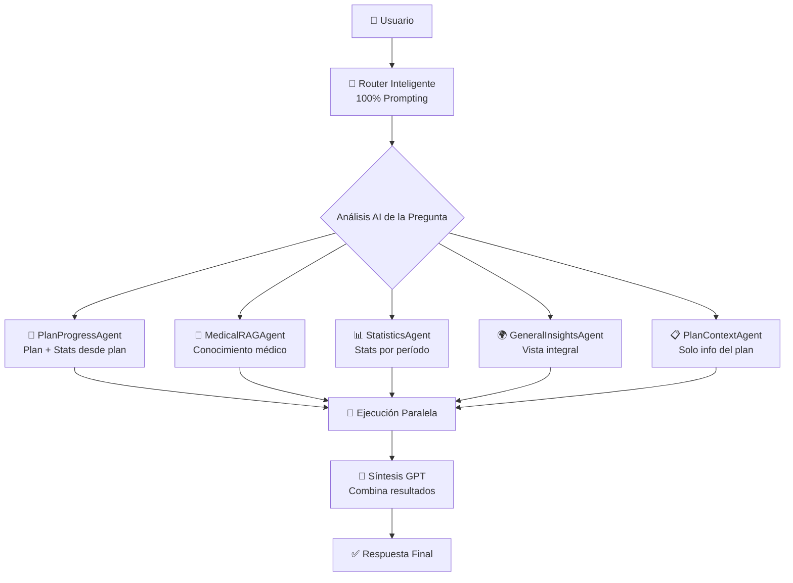

# 🎯 ARQUITECTURA DE AGENTES INTELIGENTES - Happy Dreamers

## 🏗️ DIAGRAMA DE ARQUITECTURA.



## 🎯 AGENTES DISPONIBLES

### 1. 🎯 **PlanProgressAgent** (`plan_progress`)
**Propósito**: Evalúa efectividad del plan actual
**Datos que obtiene**:
- ✅ Plan actual completo (horarios, objetivos, recomendaciones)
- ✅ Estadísticas DESDE la fecha de creación del plan actual
- ✅ Comparación progreso vs objetivos del plan

**Cuándo se usa**:
- Preguntas sobre efectividad del plan
- Evaluación de progreso
- Análisis de cumplimiento de objetivos

### 2. 🧠 **MedicalRAGAgent** (`medical_rag`)
**Propósito**: Proporciona conocimiento médico especializado
**Datos que obtiene**:
- ✅ Búsqueda en base de conocimiento médico (RAG)
- ✅ Información sobre sueño infantil, desarrollo, patrones normales
- ✅ Consejos médicos especializados

**Cuándo se usa**:
- Preguntas médicas generales
- Consejos para mejoras
- Consultas sobre normalidad de comportamientos

### 3. 📊 **StatisticsAgent** (`statistics`)
**Propósito**: Estadísticas por período específico
**Datos que obtiene**:
- ✅ Estadísticas filtradas por período exacto (julio, junio, semana, etc.)
- ✅ Métricas de sueño del período solicitado
- ✅ Comparaciones con períodos anteriores

**Cuándo se usa**:
- Preguntas sobre períodos específicos
- Análisis temporal de datos
- Comparaciones entre meses/semanas

### 4. 🌍 **GeneralInsightsAgent** (`general_insights`)
**Propósito**: Vista integral del estado del niño
**Datos que obtiene**:
- ✅ Estadísticas de últimos 30 días
- ✅ Plan actual como contexto
- ✅ Historial de evolución de planes
- ✅ Vista panorámica del estado general

**Cuándo se usa**:
- Preguntas generales sobre el estado del niño
- Consultas amplias sin enfoque específico
- Evaluaciones generales de progreso

### 5. 📋 **PlanContextAgent** (`plan_context`)
**Propósito**: Solo información del plan actual
**Datos que obtiene**:
- ✅ Plan actual completo
- ✅ Horarios establecidos
- ✅ Objetivos y recomendaciones del plan
- ✅ Información sobre la base del plan

**Cuándo se usa**:
- Consultas específicas sobre el plan
- Como complemento a otros agentes
- Cuando se necesita contexto del plan para consejos

## 🤖 ROUTER INTELIGENTE

### Cómo Funciona
El Router usa **GPT-4o-mini** con prompting para decidir qué agentes usar:

```typescript
const routerPrompt = `Eres un experto en sueño infantil que decide qué información necesitas.

PREGUNTA DEL USUARIO: "${question}"

AGENTES DISPONIBLES:
1. "plan_progress" - Plan actual + estadísticas desde que empezó el plan
2. "medical_rag" - Conocimiento médico especializado
3. "statistics" - Estadísticas por período específico
4. "general_insights" - Vista integral (últimos 30 días)
5. "plan_context" - Solo información del plan actual

Responde en JSON: {"agents": ["agent1"], "reasoning": "por qué"}`
```

### Lógica de Decisión
- **Zero keywords** - Todo basado en comprensión contextual
- **Análisis de intención** - Entiende qué tipo de información necesita
- **Combinaciones inteligentes** - Puede usar múltiples agentes
- **Fallback seguro** - Si hay error, usa `general_insights`

## 📋 TABLA DE DECISIONES DEL ROUTER

| Pregunta Ejemplo | Agentes Usados | Período | Razón |
|------------------|----------------|---------|-------|
| "¿Funciona el plan?" | `["plan_progress"]` | desde-plan | Evalúa efectividad del plan actual |
| "¿Cómo está mi niño?" | `["general_insights"]` | 30-días | Vista integral general |
| "¿Estadísticas de julio?" | `["statistics"]` | july-2025 | Período específico solicitado |
| "¿Consejos para dormir mejor?" | `["medical_rag", "plan_context"]` | - | Conocimiento médico + contexto plan |
| "¿Es normal que despierte?" | `["medical_rag", "general_insights"]` | 30-días | Médico + contexto del niño |
| "¿Qué ajustes hacer al plan?" | `["plan_progress", "medical_rag"]` | desde-plan | Progreso + conocimiento médico |
| "¿Ha mejorado desde el plan anterior?" | `["plan_progress"]` | desde-plan | Comparación con plan actual |
| "¿Cómo ha evolucionado en meses?" | `["general_insights"]` | 90-días | Vista de evolución extendida |

## 🔄 FLUJO COMPLETO DE EJECUCIÓN

### Paso 1: Análisis de la Pregunta
```
Usuario: "¿Cómo va mi niño con su plan actual?"
↓
Router AI analiza la pregunta usando GPT-4o-mini
↓ 
Decisión: {"agents": ["plan_progress"], "reasoning": "Evalúa efectividad del plan"}
```

### Paso 2: Ejecución de Agentes
```
PlanProgressAgent se ejecuta:
├── Obtiene plan actual (Plan 5)
├── Obtiene fecha de creación del plan (10 días atrás)
├── Obtiene estadísticas desde esa fecha
└── Retorna: "=== PROGRESO DEL PLAN === [datos]"
```

### Paso 3: Síntesis Final
```
GPT-4o-mini recibe:
- Pregunta original
- Resultados de PlanProgressAgent
- Contexto conversacional
↓
Genera respuesta integrada y coherente
```

## 🎮 EJEMPLOS PRÁCTICOS DETALLADOS

### Ejemplo 1: Pregunta sobre Efectividad del Plan
```
👤 Usuario: "¿Está funcionando el plan que me dieron?"

🤖 Router Decision:
{
  "agents": ["plan_progress"],
  "reasoning": "Necesita evaluar efectividad del plan actual"
}

🎯 PlanProgressAgent ejecuta:
- Plan actual: Plan 5 (creado hace 12 días)
- Estadísticas desde Plan 5: 9.2h promedio vs 9h objetivo
- Cumplimiento horarios: 85%

🧠 Síntesis GPT:
"El Plan 5 está funcionando bien después de 12 días. Jakito ha logrado 9.2 horas de sueño promedio, superando el objetivo de 9 horas. El cumplimiento de horarios es del 85%, lo cual es excelente para un plan nuevo."
```

### Ejemplo 2: Consulta Médica con Contexto
```
👤 Usuario: "¿Es normal que se despierte 3 veces por noche?"

🤖 Router Decision:
{
  "agents": ["medical_rag", "general_insights"],
  "reasoning": "Pregunta médica que requiere conocimiento especializado y contexto del niño"
}

🧠 MedicalRAGAgent ejecuta:
- Busca: "despertares nocturnos niños edad"
- Encuentra: Información sobre patrones normales de sueño

🌍 GeneralInsightsAgent ejecuta:
- Estadísticas últimos 30 días: 2.1 despertares promedio
- Plan actual: Objetivos de sueño continuo
- Evolución: Mejora desde plan anterior

🧠 Síntesis GPT:
"Para la edad de Jakito, 2-3 despertares nocturnos pueden ser normales. Sus datos muestran 2.1 despertares promedio en el último mes, lo cual está dentro del rango esperado. El Plan 5 está ayudando a mejorar la continuidad del sueño comparado con planes anteriores."
```

### Ejemplo 3: Período Específico
```
👤 Usuario: "¿Cuáles fueron las estadísticas de julio?"

🤖 Router Decision:
{
  "agents": ["statistics"],
  "reasoning": "Solicita datos específicos del período julio",
  "period": "july-2025"
}

📊 StatisticsAgent ejecuta:
- Filtra SOLO eventos de julio 2025
- Calcula métricas del período
- Compara con otros meses

🧠 Síntesis GPT:
"En julio, Jakito durmió un promedio de 8.2 horas por noche, con 1.8 despertares nocturnos. Esto representa una mejora del 15% comparado con junio, especialmente en la duración total del sueño."
```

### Ejemplo 4: Consejos Personalizados
```
👤 Usuario: "¿Qué consejos me das para mejorar su sueño?"

🤖 Router Decision:
{
  "agents": ["medical_rag", "plan_context"],
  "reasoning": "Necesita conocimiento médico personalizado con el contexto del plan actual"
}

🧠 MedicalRAGAgent ejecuta:
- Busca: "consejos mejorar sueño infantil"
- Encuentra: Técnicas y recomendaciones médicas

📋 PlanContextAgent ejecuta:
- Plan actual: horarios, rutinas establecidas
- Objetivos específicos del plan
- Recomendaciones ya implementadas

🧠 Síntesis GPT:
"Basándome en el Plan 5 actual, recomiendo: 1) Mantener la rutina de las 20:00 que ya está funcionando, 2) Implementar 10 minutos adicionales de actividad calmante antes de dormir, 3) Considerar ajustar la temperatura del cuarto a 18-20°C según los patrones de despertares observados."
```

## ⚡ VENTAJAS DE LA NUEVA ARQUITECTURA

### 🎯 Eficiencia
- **Solo ejecuta lo necesario** - No desperdicia recursos
- **Ejecución paralela** - Agentes corren simultáneamente
- **Caché inteligente** - Reutiliza resultados cuando es posible

### 🧠 Inteligencia
- **Cero keywords** - Comprensión contextual real
- **Decisiones adaptativas** - Router se adapta a cada pregunta
- **Combinaciones flexibles** - Puede usar cualquier combinación de agentes

### 🔧 Mantenibilidad  
- **Agentes especializados** - Cada uno con responsabilidad clara
- **Fácil extensión** - Agregar nuevos agentes es simple
- **Debugging claro** - Logs muestran exactamente qué agentes se usaron

### 📊 Observabilidad
- **Logs detallados** - Qué agentes se ejecutaron y por qué
- **Métricas de performance** - Tiempo de ejecución por agente
- **Trazabilidad completa** - Desde pregunta hasta respuesta

## 🚀 ESTADO ACTUAL

✅ **5 Agentes Especializados** implementados y funcionando
✅ **Router Inteligente** con prompting puro (sin keywords)  
✅ **Orquestador Principal** que coordina todo
✅ **Ejecución Paralela** para máxima eficiencia
✅ **Síntesis Inteligente** que combina resultados coherentemente
✅ **Sistema Compilando** y listo para pruebas

---

**El sistema ahora es verdaderamente inteligente y modular. Cada agente tiene su especialidad, el router decide dinámicamente qué usar, y el orquestador combina todo de manera coherente.** 🎉