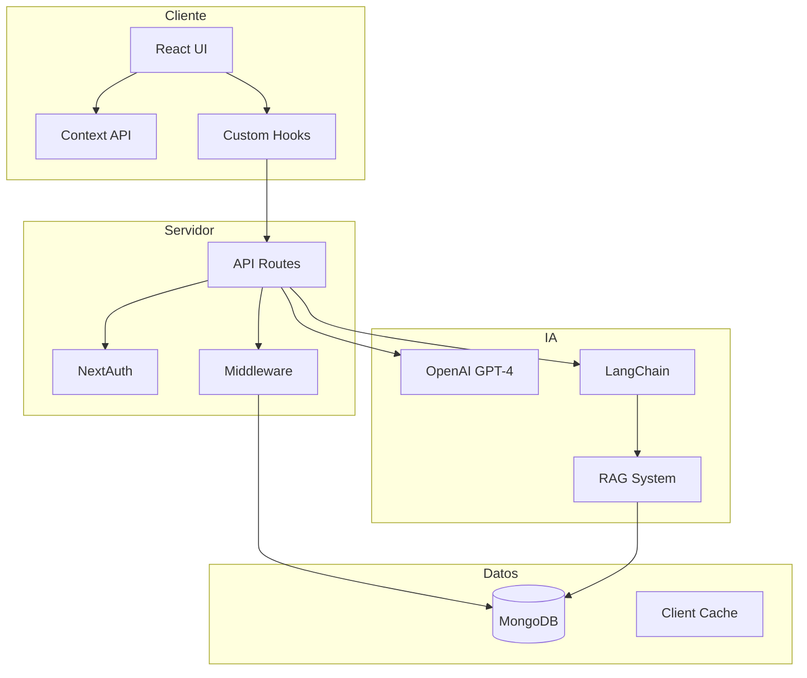

# 🏗️ Arquitectura del Sistema - Happy Dreamers

## 📋 Tabla de Contenidos

- [Visión General](#visión-general)
- [Principios Arquitectónicos](#principios-arquitectónicos)
- [Arquitectura de Alto Nivel](#arquitectura-de-alto-nivel)
- [Componentes del Sistema](#componentes-del-sistema)
- [Flujo de Datos](#flujo-de-datos)
- [Patrones de Diseño](#patrones-de-diseño)
- [Decisiones Técnicas](#decisiones-técnicas)
- [Seguridad](#seguridad)
- [Escalabilidad](#escalabilidad)

## 🎯 Visión General

Happy Dreamers sigue una arquitectura **Serverless Monolítica** con características de microservicios, construida sobre Next.js 15 con App Router. Esta arquitectura proporciona:

- **Simplicidad de Desarrollo**: Un único repositorio y despliegue
- **Escalabilidad Automática**: Aprovecha la infraestructura serverless
- **Separación de Concerns**: Clara división entre capas
- **Type Safety**: TypeScript en todo el stack

## 🏛️ Principios Arquitectónicos

### 1. Domain-Driven Design (DDD)
- Modelos de dominio claramente definidos
- Contextos delimitados (Bounded Contexts)
- Lenguaje ubicuo compartido

### 2. Separation of Concerns
- Capa de presentación (React Components)
- Capa de lógica de negocio (API Routes)
- Capa de datos (MongoDB)
- Capa de infraestructura (Utilities)

### 3. Single Responsibility
- Cada componente tiene una responsabilidad única
- Funciones puras cuando es posible
- Efectos secundarios aislados

### 4. Don't Repeat Yourself (DRY)
- Componentes reutilizables
- Hooks personalizados para lógica compartida
- Utilidades centralizadas

## 🏗️ Arquitectura de Alto Nivel



## 🔧 Componentes del Sistema

### Frontend Layer

#### Componentes React
```typescript
components/
├── ui/               # Primitivas UI (botones, inputs, etc.)
├── dashboard/        # Componentes específicos del dashboard
├── events/           # Gestión de eventos de sueño
├── consultas/        # Sistema de consultas IA
├── survey/           # Wizard de encuestas
└── stats/            # Visualizaciones y gráficos
```

#### State Management
```typescript
// Context Providers
context/
├── active-child-context.tsx    # Niño activo seleccionado
└── page-header-context.tsx     # Estado del header

// Custom Hooks
hooks/
├── use-children.ts             # Gestión de niños
├── use-sleep-data.ts          # Datos de sueño
├── use-events-cache.ts        # Cache de eventos
└── use-sleep-insights.ts      # Insights de IA
```

### Backend Layer

#### API Routes Structure
```typescript
app/api/
├── auth/           # Autenticación y registro
│   ├── [...nextauth]/
│   └── register/
├── children/       # CRUD de niños
│   ├── route.ts
│   └── [id]/
├── events/         # Eventos de sueño
├── consultas/      # Consultas IA
│   ├── analyze/
│   ├── history/
│   └── plans/
├── rag/           # Sistema RAG
│   ├── chat/
│   ├── documents/
│   └── upload/
└── admin/         # Funciones administrativas
```

#### Middleware Stack
```typescript
// Orden de ejecución
1. CORS Headers
2. Authentication (NextAuth)
3. Authorization (Role-based)
4. Validation (Zod)
5. Error Handling
6. Logging
7. Business Logic
8. Response Formatting
```

### Data Layer

#### MongoDB Collections
```javascript
{
  users: {
    _id: ObjectId,
    email: String,
    name: String,
    role: String,
    children: [ObjectId]
  },
  
  children: {
    _id: ObjectId,
    firstName: String,
    lastName: String,
    birthDate: String,
    parentId: ObjectId,
    surveyData: Object,
    events: [Object]
  },
  
  events: {
    _id: ObjectId,
    childId: ObjectId,
    type: String,
    timestamp: Date,
    duration: Number,
    emotionalState: String
  },
  
  consultations: {
    _id: ObjectId,
    childId: ObjectId,
    date: Date,
    analysis: Object,
    recommendations: Array
  }
}
```

### AI Layer

#### RAG Architecture
```typescript
// Document Processing Pipeline
1. Upload Document → 
2. Extract Text (Mammoth) →
3. Chunk Text →
4. Generate Embeddings (OpenAI) →
5. Store in Vector DB →
6. Query Processing →
7. Context Retrieval →
8. LLM Generation (GPT-4)
```

## 🔄 Flujo de Datos

### Request Flow
```
1. User Action (Click/Submit)
   ↓
2. React Component State Update
   ↓
3. Custom Hook Called
   ↓
4. API Request (fetch)
   ↓
5. API Route Handler
   ↓
6. Authentication Check
   ↓
7. Business Logic
   ↓
8. Database Operation
   ↓
9. Response Formatting
   ↓
10. UI Update
```

### Data Flow Patterns

#### Unidirectional Data Flow
```typescript
// Ejemplo: Actualizar información de niño
User Input → Component → Hook → API → DB
                ↓
        Context Update ← Response ←
                ↓
          UI Re-render
```

#### Event-Driven Updates
```typescript
// Ejemplo: Registro de evento de sueño
Event Registration → API → DB Write
                      ↓
              Cache Invalidation
                      ↓
              Background Analysis
                      ↓
              Insights Generation
```

## 🎨 Patrones de Diseño

### 1. Singleton Pattern
```typescript
// lib/mongodb.ts
let clientPromise: Promise<MongoClient>

if (process.env.NODE_ENV === "development") {
  // Reutilizar conexión en desarrollo
  if (!global._mongoClientPromise) {
    client = new MongoClient(uri)
    global._mongoClientPromise = client.connect()
  }
  clientPromise = global._mongoClientPromise
}
```

### 2. Factory Pattern
```typescript
// lib/logger.ts
export function createLogger(namespace: string) {
  return new Logger(namespace)
}
```

### 3. Provider Pattern
```typescript
// context/active-child-context.tsx
export const ActiveChildProvider = ({ children }) => {
  const [activeChildId, setActiveChildId] = useState(null)
  
  return (
    <ActiveChildContext.Provider value={{ activeChildId, setActiveChildId }}>
      {children}
    </ActiveChildContext.Provider>
  )
}
```

### 4. Custom Hook Pattern
```typescript
// hooks/use-children.ts
export function useChildren() {
  const [children, setChildren] = useState([])
  const [isLoading, setIsLoading] = useState(true)
  
  const fetchChildren = async () => {
    // Lógica de fetching
  }
  
  return { children, isLoading, fetchChildren }
}
```

### 5. Middleware Pattern
```typescript
// lib/api-utils.ts
export function withErrorHandler(handler) {
  return async (...args) => {
    try {
      return await handler(...args)
    } catch (error) {
      // Manejo centralizado de errores
    }
  }
}
```

## 🔐 Decisiones Técnicas

### ¿Por qué Next.js 15 con App Router?
- **Server Components**: Mejor performance y SEO
- **API Routes**: Backend integrado
- **File-based Routing**: Simplicidad y convención
- **Built-in Optimizations**: Image, font, script optimization

### ¿Por qué MongoDB?
- **Flexibilidad de Esquema**: Ideal para datos de encuestas variables
- **Escalabilidad Horizontal**: Crecimiento futuro
- **Aggregation Pipeline**: Análisis complejos
- **Atlas Search**: Búsqueda de texto completo

### ¿Por qué TypeScript?
- **Type Safety**: Menos errores en runtime
- **Better DX**: Autocompletado y refactoring
- **Documentation**: Tipos como documentación
- **Maintenance**: Más fácil de mantener

### ¿Por qué Tailwind CSS?
- **Utility-First**: Desarrollo rápido
- **Consistency**: Sistema de diseño coherente
- **Performance**: CSS optimizado
- **Customization**: Fácil de personalizar

### ¿Por qué OpenAI GPT-4?
- **State-of-the-art**: Mejor modelo disponible
- **Contextual Understanding**: Comprensión profunda
- **Multi-language**: Soporte para español
- **Reliability**: API estable y confiable

## 🔒 Seguridad

### Capas de Seguridad

#### 1. Authentication Layer
- NextAuth.js con JWT
- Session management
- Secure cookie handling

#### 2. Authorization Layer
- Role-based access control (RBAC)
- Resource-level permissions
- Parent-child data isolation

#### 3. Data Protection
- Password hashing (bcrypt)
- Environment variables for secrets
- Input validation (Zod)
- SQL injection prevention (MongoDB)

#### 4. API Security
- Rate limiting (pendiente)
- CORS configuration
- Request validation
- Error message sanitization

## 📈 Escalabilidad

### Estrategias Actuales

#### Vertical Scaling
- Serverless auto-scaling (Vercel)
- Database connection pooling
- Efficient query optimization

#### Horizontal Scaling
- Stateless API design
- Client-side caching
- CDN for static assets

### Plan de Escalabilidad Futura

#### Fase 1: Optimización (0-6 meses)
- Implementar Redis cache
- Database indexing
- Query optimization
- Bundle size reduction

#### Fase 2: Distribución (6-12 meses)
- CDN implementation
- Database replication
- Load balancing
- Background job queue

#### Fase 3: Microservicios (12+ meses)
- Extract AI services
- Separate auth service
- Event-driven architecture
- API Gateway

## 🔄 Ciclo de Vida de Request

### Ejemplo: Registro de Evento de Sueño

```typescript
// 1. Cliente: Componente React
const EventRegistration = () => {
  const { registerEvent } = useEvents()
  
  const handleSubmit = async (data) => {
    await registerEvent(data)
  }
}

// 2. Hook personalizado
const useEvents = () => {
  const registerEvent = async (data) => {
    const response = await fetch('/api/events', {
      method: 'POST',
      body: JSON.stringify(data)
    })
    return response.json()
  }
}

// 3. API Route
export async function POST(request) {
  const session = await requireAuth()
  const data = await request.json()
  
  // Validación
  const validated = eventSchema.parse(data)
  
  // Guardar en DB
  const event = await db.collection('events').insertOne(validated)
  
  // Trigger análisis
  await analyzeEvent(event)
  
  return NextResponse.json({ success: true })
}

// 4. Análisis de IA
async function analyzeEvent(event) {
  const insights = await openai.generateInsights(event)
  await db.collection('insights').insertOne(insights)
}
```

## 🏁 Conclusión

La arquitectura de Happy Dreamers está diseñada para ser:
- **Mantenible**: Clara separación de responsabilidades
- **Escalable**: Preparada para crecimiento
- **Segura**: Múltiples capas de protección
- **Performante**: Optimizaciones en cada capa
- **Flexible**: Fácil de extender y modificar

Esta arquitectura proporciona una base sólida para el crecimiento futuro mientras mantiene la simplicidad y eficiencia en el desarrollo actual.