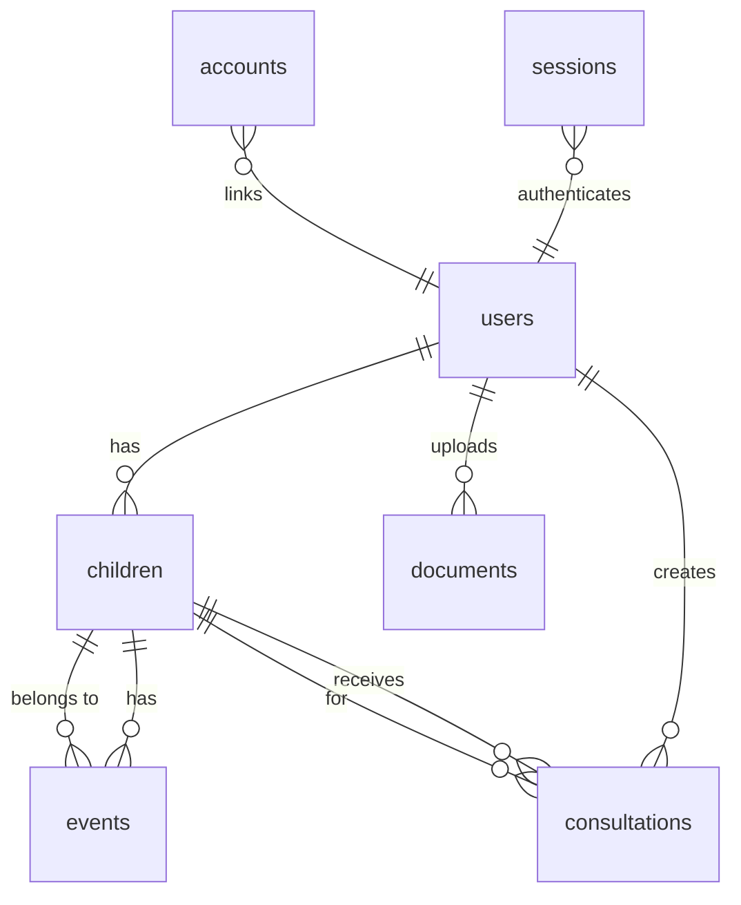

# =� Base de Datos - Happy Dreamers

## =� Tabla de Contenidos

- [Visi�n General](#visi�n-general)
- [MongoDB Setup](#mongodb-setup)
- [Esquema de Colecciones](#esquema-de-colecciones)
- [�ndices](#�ndices)
- [Relaciones](#relaciones)
- [Migraciones](#migraciones)
- [Backup y Recuperaci�n](#backup-y-recuperaci�n)
- [Optimizaci�n](#optimizaci�n)

## <� Visi�n General

Happy Dreamers utiliza MongoDB como base de datos principal por su:
- **Flexibilidad de esquema** para datos de encuestas variables
- **Escalabilidad horizontal** para crecimiento futuro
- **Rendimiento** en operaciones de lectura/escritura
- **Aggregation Pipeline** para an�lisis complejos

### Conexi�n

```typescript
// lib/mongodb.ts
const uri = process.env.MONGODB_URI
const options = {}

let clientPromise: Promise<MongoClient>

if (process.env.NODE_ENV === "development") {
  // Singleton pattern en desarrollo
  if (!global._mongoClientPromise) {
    client = new MongoClient(uri, options)
    global._mongoClientPromise = client.connect()
  }
  clientPromise = global._mongoClientPromise
} else {
  client = new MongoClient(uri, options)
  clientPromise = client.connect()
}
```

## =� Esquema de Colecciones

### users

```javascript
{
  _id: ObjectId,
  email: String,            // �nico, �ndice
  name: String,
  password: String,          // Hash bcrypt
  role: String,              // "parent" | "admin" | "professional"
  children: [ObjectId],      // Referencias a colecci�n children
  image: String,             // URL de avatar
  emailVerified: Date,
  createdAt: Date,
  updatedAt: Date
}

// �ndices:
- email: 1 (unique)
- role: 1
- createdAt: -1
```

### children

```javascript
{
  _id: ObjectId,
  firstName: String,
  lastName: String,
  birthDate: String,         // ISO date string
  parentId: ObjectId,        // Referencia a users
  surveyData: {              // Datos de encuesta completa
    completedAt: Date,
    informacionFamiliar: {
      papa: {
        nombre: String,
        edad: Number,
        ocupacion: String,
        direccion: String,
        ciudad: String,
        telefono: String,
        email: String,
        trabajaFueraCasa: Boolean,
        tieneAlergias: Boolean,
        alergias: String
      },
      mama: {
        nombre: String,
        edad: Number,
        ocupacion: String,
        mismaDireccionPapa: Boolean,
        direccion: String,
        ciudad: String,
        telefono: String,
        email: String,
        trabajaFueraCasa: Boolean,
        puedeDormirConHijo: Boolean,
        apetito: String,
        pensamientosNegativos: Boolean,
        tieneAlergias: Boolean,
        alergias: String
      }
    },
    dinamicaFamiliar: {
      cantidadHijos: Number,
      hijosInfo: [{
        nombre: String,
        fechaNacimiento: String,
        edad: Number,
        esElQueNecesitaAyuda: Boolean
      }],
      otrosEnCasa: String,
      telefonoSeguimiento: String,
      emailObservaciones: String,
      comoConocioServicios: String,
      librosConsultados: String,
      metodosEnContra: String,
      asesorAnterior: String,
      quienSeLevaantaNoche: String
    },
    historial: {
      nombre: String,
      fechaNacimiento: String,
      peso: Number,
      percentilPeso: Number,
      embarazoPlaneado: Boolean,
      problemasEmbarazo: Boolean,
      problemasEmbarazoDescripcion: String,
      padecimientosEmbarazo: [String],
      tipoParto: String,
      complicacionesParto: Boolean,
      complicacionesPartoDescripcion: String,
      nacioPlazo: Boolean,
      problemasAlNacer: Boolean,
      problemasAlNacerDescripcion: String,
      pediatra: String,
      pediatraDescartaProblemas: Boolean,
      pediatraConfirmaCapacidadDormir: Boolean,
      tratamientoMedico: Boolean,
      tratamientoMedicoDescripcion: String
    },
    desarrolloSalud: {
      edadRodar: Number,
      edadSentarse: Number,
      edadGatear: Number,
      edadPararse: Number,
      edadCaminar: Number,
      usoVaso: String,
      alimentacion: String,
      comeSolidos: Boolean,
      caracteristicas: [String]
    },
    actividadFisica: {
      vePantallas: Boolean,
      pantallasTiempo: String,
      practicaActividad: Boolean,
      actividades: String,
      actividadesDespierto: String,
      signosIrritabilidad: Boolean,
      situacionesSufridas: [String]
    },
    rutinaHabitos: {
      diaTypico: String,
      vaGuarderia: Boolean,
      quienPasaTiempo: String,
      quienCuidaNoche: String,
      dondeVurmePadresSalen: String,
      rutinaAntesAcostarse: String,
      horaEspecificaDormir: Boolean,
      horaDormir: String,
      seQuedaDormirSolo: Boolean
    }
  },
  events: [ObjectId],        // Referencias a colecci�n events
  createdAt: Date,
  updatedAt: Date
}

// �ndices:
- parentId: 1
- birthDate: 1
- createdAt: -1
```

### events (Sistema v5.0)

```javascript
{
  _id: ObjectId,
  childId: ObjectId,         // Referencia a children
  eventType: String,          // "sleep" | "nap" | "night_waking" | "feeding" | "medication" | "extra_activities" | "note"
  startTime: Date,           // Hora de inicio del evento
  endTime: Date,             // Hora de fin (opcional, para eventos con duración)
  duration: Number,          // Duración calculada en minutos
  durationReadable: String,  // Duración en formato legible ("2h 30min")
  emotionalState: String,    // "tranquilo" | "inquieto" | "irritable" | "neutral"
  notes: String,             // Notas generales
  
  // Campos específicos de sueño
  sleepDelay: Number,        // Minutos para dormirse
  awakeDelay: Number,        // Minutos despierto (para night_waking)
  
  // Campos específicos de alimentación
  feedingType: String,       // "breast" | "bottle" | "solids"
  feedingAmount: Number,     // Cantidad en ml o gr
  feedingDuration: Number,   // Duración en minutos
  babyState: String,         // "awake" | "asleep"
  feedingNotes: String,      // Notas específicas de alimentación
  
  // Campos específicos de medicamentos (v5.0)
  medicationName: String,    // Nombre del medicamento
  medicationDose: String,    // Dosis administrada
  medicationTime: String,    // Hora de administración
  medicationNotes: String,   // Notas adicionales del medicamento
  
  // Campos específicos de actividades extra (v5.0)
  activityDescription: String,  // Descripción de la actividad
  activityDuration: Number,     // Duración en minutos
  activityImpact: String,       // "positive" | "neutral" | "negative"
  activityNotes: String,        // Notas adicionales de la actividad
  
  caregiverId: ObjectId,     // Quién registró el evento
  createdAt: Date,
  updatedAt: Date
}

// Índices:
- childId: 1, startTime: -1 (compound)
- eventType: 1
- startTime: -1
- emotionalState: 1
- medicationName: 1 (para búsquedas de medicamentos)
- activityDescription: 1 (para búsquedas de actividades)
```

### consultations

```javascript
{
  _id: ObjectId,
  childId: ObjectId,
  userId: ObjectId,
  date: Date,
  type: String,               // "AI_ANALYSIS" | "PROFESSIONAL" | "FOLLOW_UP"
  transcript: String,         // Transcripci�n original
  analysis: {
    summary: String,
    patterns: [{
      type: String,
      description: String,
      frequency: String,
      severity: String,
      possibleCauses: [String]
    }],
    recommendations: [{
      priority: String,       // "HIGH" | "MEDIUM" | "LOW"
      title: String,
      description: String,
      timeline: String
    }],
    confidenceScore: Number,  // 0-1
    aiModel: String,          // "gpt-4" | etc.
    tokensUsed: Number
  },
  plan: {
    duration: String,
    phases: [{
      week: Number,
      focus: String,
      actions: [String],
      goals: [String]
    }],
    expectedOutcomes: [String],
    checkpoints: [Date]
  },
  followUp: {
    scheduled: Date,
    completed: Boolean,
    notes: String
  },
  createdAt: Date,
  updatedAt: Date
}

// �ndices:
- childId: 1, date: -1
- userId: 1
- type: 1
- createdAt: -1
```

### documents (RAG)

```javascript
{
  _id: ObjectId,
  title: String,
  category: String,           // "educational" | "research" | "guidelines"
  uploadedBy: ObjectId,
  uploadedAt: Date,
  fileType: String,           // "pdf" | "docx" | "txt"
  originalName: String,
  size: Number,               // Bytes
  content: String,            // Texto extra�do
  chunks: [{
    chunkId: String,
    text: String,
    embedding: [Number],      // Vector embedding
    metadata: {
      page: Number,
      section: String
    }
  }],
  metadata: {
    author: String,
    publishedDate: Date,
    language: String,
    tags: [String]
  },
  status: String,             // "processing" | "ready" | "error"
  error: String,
  createdAt: Date,
  updatedAt: Date
}

// �ndices:
- title: "text"
- category: 1
- uploadedBy: 1
- status: 1
```

### sessions (NextAuth)

```javascript
{
  _id: ObjectId,
  sessionToken: String,       // �nico
  userId: ObjectId,
  expires: Date
}

// �ndices:
- sessionToken: 1 (unique)
- userId: 1
- expires: 1
```

### accounts (NextAuth)

```javascript
{
  _id: ObjectId,
  userId: ObjectId,
  type: String,
  provider: String,
  providerAccountId: String,
  refresh_token: String,
  access_token: String,
  expires_at: Number,
  token_type: String,
  scope: String,
  id_token: String,
  session_state: String
}

// �ndices:
- userId: 1
- provider: 1, providerAccountId: 1 (compound unique)
```

## = Relaciones



## =' �ndices

### �ndices Recomendados

```javascript
// users
db.users.createIndex({ email: 1 }, { unique: true })
db.users.createIndex({ role: 1 })
db.users.createIndex({ createdAt: -1 })

// children
db.children.createIndex({ parentId: 1 })
db.children.createIndex({ birthDate: 1 })
db.children.createIndex({ "surveyData.completedAt": 1 })

// events
db.events.createIndex({ childId: 1, timestamp: -1 })
db.events.createIndex({ type: 1 })
db.events.createIndex({ emotionalState: 1 })
db.events.createIndex({ quality: 1 })

// consultations
db.consultations.createIndex({ childId: 1, date: -1 })
db.consultations.createIndex({ userId: 1 })
db.consultations.createIndex({ type: 1 })

// documents (text search)
db.documents.createIndex({ title: "text", "metadata.tags": "text" })
```

## = Migraciones

### Estrategia de Migraci�n

```javascript
// scripts/migrations/001_add_field.js
export async function up(db) {
  await db.collection('children').updateMany(
    {},
    { $set: { newField: defaultValue } }
  )
}

export async function down(db) {
  await db.collection('children').updateMany(
    {},
    { $unset: { newField: "" } }
  )
}
```

### Versionado de Esquema

```javascript
// En cada documento
{
  _id: ObjectId,
  schemaVersion: 1,  // Versi�n del esquema
  // ... resto de campos
}
```

## =� Backup y Recuperaci�n

### Backup Manual

```bash
# Backup completo
mongodump --uri="$MONGODB_URI" --out=./backup/$(date +%Y%m%d)

# Backup de colecci�n espec�fica
mongodump --uri="$MONGODB_URI" --collection=children --out=./backup/

# Backup con compresi�n
mongodump --uri="$MONGODB_URI" --gzip --archive=backup-$(date +%Y%m%d).gz
```

### Restauraci�n

```bash
# Restaurar backup completo
mongorestore --uri="$MONGODB_URI" ./backup/20240120/

# Restaurar colecci�n espec�fica
mongorestore --uri="$MONGODB_URI" --collection=children ./backup/children.bson

# Restaurar desde archivo comprimido
mongorestore --uri="$MONGODB_URI" --gzip --archive=backup-20240120.gz
```

### Backup Autom�tico (MongoDB Atlas)

```yaml
# Configuraci�n recomendada:
backup:
  enabled: true
  schedule: "0 2 * * *"  # 2 AM diario
  retention: 7            # D�as
  snapshots:
    - daily: 7
    - weekly: 4
    - monthly: 3
```

## � Optimizaci�n

### Consultas Optimizadas

```javascript
//  Bueno: Usar proyecci�n
db.children.find(
  { parentId: ObjectId(parentId) },
  { firstName: 1, lastName: 1, birthDate: 1 }
)

//  Bueno: Usar �ndices compound
db.events.find({
  childId: ObjectId(childId),
  timestamp: { $gte: startDate, $lte: endDate }
}).sort({ timestamp: -1 })

// L Evitar: Consultas sin �ndices
db.events.find({
  notes: /patron/  // Regex sin �ndice
})
```

### Aggregation Pipeline

```javascript
// Estad�sticas de sue�o por mes
db.events.aggregate([
  {
    $match: {
      childId: ObjectId(childId),
      type: "NIGHT_SLEEP",
      timestamp: { $gte: startDate }
    }
  },
  {
    $group: {
      _id: {
        year: { $year: "$timestamp" },
        month: { $month: "$timestamp" }
      },
      totalHours: { $sum: { $divide: ["$duration", 60] } },
      avgQuality: { $avg: "$quality" },
      count: { $sum: 1 }
    }
  },
  {
    $sort: { "_id.year": 1, "_id.month": 1 }
  }
])
```

### Connection Pooling

```javascript
// Configuraci�n de pool
const options = {
  maxPoolSize: 10,
  minPoolSize: 2,
  maxIdleTimeMS: 10000,
  waitQueueTimeoutMS: 5000
}
```

### Cach� de Consultas

```typescript
// Implementar cach� en memoria
const cache = new Map()

function getCachedData(key: string, ttl: number = 300000) {
  const cached = cache.get(key)
  if (cached && Date.now() - cached.timestamp < ttl) {
    return cached.data
  }
  return null
}

function setCachedData(key: string, data: any) {
  cache.set(key, {
    data,
    timestamp: Date.now()
  })
}
```

## =� Monitoring

### M�tricas Clave

```javascript
// Queries lentas
db.setProfilingLevel(1, { slowms: 100 })
db.system.profile.find().limit(10).sort({ ts: -1 })

// Tama�o de colecciones
db.children.stats()
db.events.stats()

// �ndices no utilizados
db.events.aggregate([
  { $indexStats: {} },
  { $match: { "accesses.ops": { $lt: 100 } } }
])
```

### Health Checks

```typescript
// api/health/db
export async function GET() {
  try {
    const client = await clientPromise
    await client.db().admin().ping()
    
    return NextResponse.json({
      status: "healthy",
      timestamp: new Date().toISOString()
    })
  } catch (error) {
    return NextResponse.json({
      status: "unhealthy",
      error: error.message
    }, { status: 503 })
  }
}
```

---

**�ltima actualizaci�n:** Enero 2024  
**Versi�n:** 1.0.0