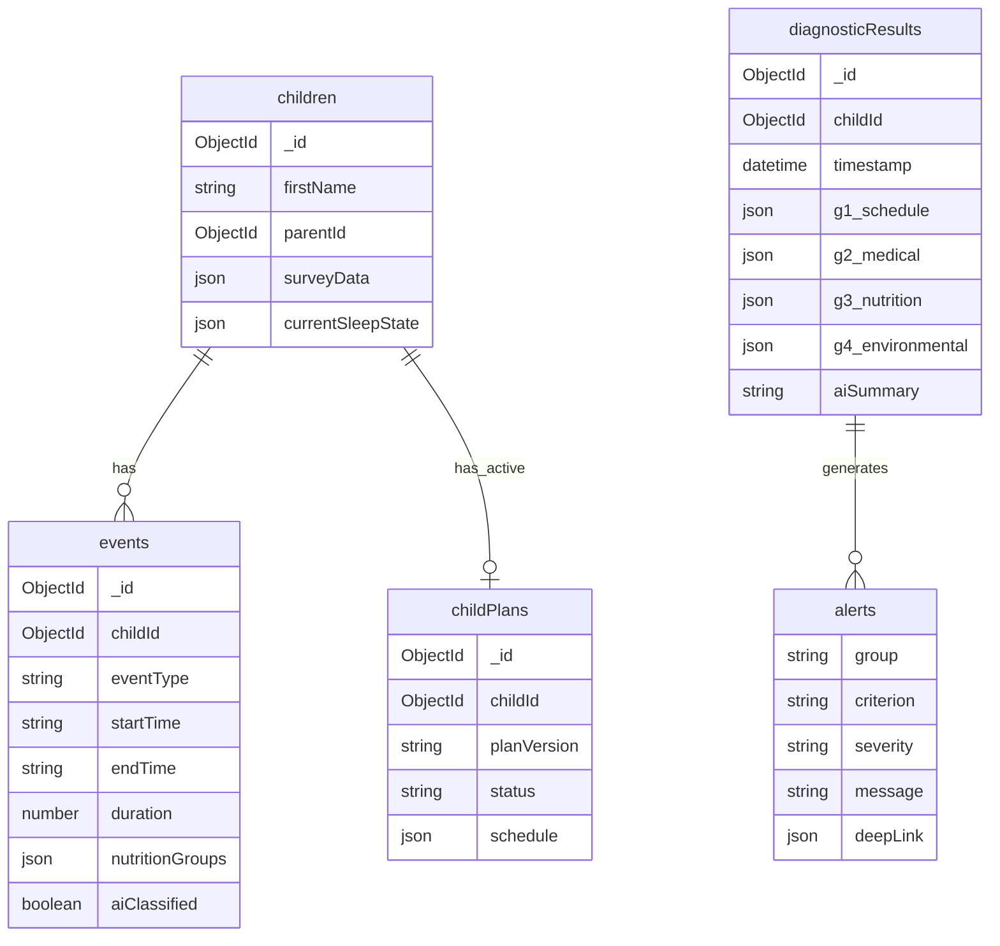

# Panel de Diagnóstico (Estadísticas) - Item 4

## Resumen Ejecutivo

Motor de validación admin-only que cruza la bitácora en tiempo real con las respuestas del cuestionario y las reglas clínicas de Happy Dreamers. Permite a Mariana auditar el progreso de cada niño y tomar decisiones informadas sobre su plan de sueño.

**Audiencia:** Solo Admin (Mariana)
**Ubicación:** Dashboard Admin > Estadísticas de Sueño
**Prerequisito:** El niño debe tener un plan activo

## Overview

### Problema
Mariana necesita una forma eficiente de validar si los niños están siguiendo sus planes de sueño correctamente, detectar indicadores médicos temprano, validar que la alimentación sea apropiada por edad, y monitorear factores ambientales/emocionales que afecten el sueño.

### Solución Propuesta
Un panel de diagnóstico con 4 grupos de validación (Horario, Médico, Alimentación, Ambiental) que muestran alertas tipo semáforo, con deep-linking a datos fuente y un "Pasante AI" que genera análisis descriptivos on-demand.

## Arquitectura Técnica

### Estructura de Archivos

```
/app/dashboard/diagnosticos/
├── page.tsx                           # Página admin-only (Server Component)
└── [childId]/
    ├── page.tsx                       # Página de diagnóstico por niño
    └── DiagnosticPanelClient.tsx      # Client component principal

/components/diagnostic/
├── ProfileHeader.tsx                  # Cabecera con perfil clínico
├── DiagnosticPanel.tsx                # Panel principal con los 4 grupos
├── ValidationGroups/
│   ├── G1ScheduleValidation.tsx       # Grupo 1: Horario
│   ├── G2MedicalValidation.tsx        # Grupo 2: Médico
│   ├── G3NutritionValidation.tsx      # Grupo 3: Alimentación
│   └── G4EnvironmentalValidation.tsx  # Grupo 4: Ambiental
├── Modals/
│   ├── AlertDetailModal.tsx           # Modal overlay solo lectura
│   └── CriteriaBreakdownModal.tsx     # Desglose de criterios
├── AIAnalysis/
│   ├── PasanteAISection.tsx           # Sección del resumen AI
│   └── PasanteAIButton.tsx            # Botón on-demand
└── Actions/
    ├── EditPlanButton.tsx             # CTA editar plan actual
    └── GenerateNewPlanButton.tsx      # CTA generar plan AI

/lib/diagnostic/
├── types.ts                           # Interfaces y tipos
├── validation-engine.ts               # Motor de reglas principal
├── rules/
│   ├── schedule-rules.ts              # Reglas G1 (horario por edad)
│   ├── medical-rules.ts               # Reglas G2 (indicadores médicos)
│   ├── nutrition-rules.ts             # Reglas G3 (alimentación)
│   └── environmental-rules.ts         # Reglas G4 (ambiental)
├── age-schedules.ts                   # Tablas de horarios por edad
├── nutrition-requirements.ts          # Requisitos nutricionales por edad
└── ai-food-classifier.ts              # Clasificador AI de alimentos

/app/api/admin/diagnostics/
├── [childId]/
│   ├── route.ts                       # GET diagnóstico completo
│   └── validate/route.ts              # POST forzar revalidación
├── ai-summary/route.ts                # POST generar resumen AI (on-demand)
└── classify-food/route.ts             # POST clasificar alimento (tiempo real)
```

### Interfaces Core

```typescript
// /lib/diagnostic/types.ts

export type StatusLevel = 'ok' | 'warning' | 'alert'
export type SourceType = 'survey' | 'event' | 'calculated' | 'chat'
export type MedicalCondition = 'reflux' | 'apnea_allergy' | 'restless_leg'
export type NutritionGroup = 'protein' | 'carbs' | 'fat' | 'fiber'

export interface DiagnosticResult {
  childId: string
  timestamp: Date
  groups: {
    g1_schedule: GroupValidation
    g2_medical: GroupValidation
    g3_nutrition: GroupValidation
    g4_environmental: GroupValidation
  }
  aiSummary?: string
  alerts: Alert[]
}

export interface GroupValidation {
  status: StatusLevel
  criteria: CriterionResult[]
  dataCompleteness?: {
    available: number
    total: number
    pending: string[]
  }
}

export interface CriterionResult {
  name: string
  passed: boolean
  value?: any
  expected?: any
  sourceType: SourceType
  sourceId?: string  // Para deep linking
  condition?: MedicalCondition  // Solo G2
  dataAvailable: boolean
}

export interface Alert {
  group: 'g1' | 'g2' | 'g3' | 'g4'
  criterion: string
  severity: StatusLevel
  message: string
  deepLink: {
    type: SourceType
    id: string
    field?: string
  }
}

export interface NutritionClassification {
  eventId: string
  feedingNotes: string
  nutritionGroups: NutritionGroup[]
  aiClassified: boolean
  classifiedAt: Date
}
```

## Grupos de Validación

### G1: Horario (Schedule)

**Datos disponibles:** ✅ 100%

#### Reglas de Validación

| Criterio | Regla | Tolerancia |
|----------|-------|------------|
| Desvío de despertar | `hora_real` vs `hora_meta` del plan | ±15 min |
| Límite inferior | Despertar antes de 6:00 AM | Fijo |
| Duración de noche | Por edad (11h hasta 2.5 años, -30min/año después) | ±30 min |
| Ventanas de sueño | Por tabla de edad | Según tabla |
| Siestas fuera de rango | Hora mín, máx pre-bedtime, duración | Por edad |
| Siesta >3 años | Después de 2 PM | Bandera roja |

#### Tabla de Referencia (Extracto)

| Edad | Siestas | Ventanas | Siesta Máx | No Antes | Pre-Bedtime |
|------|---------|----------|------------|----------|-------------|
| 6 m | 3 | 1.5, 2, 2.5, 2.5-3 hrs | 1.5 hrs | 8 AM | 2.5 hrs |
| 8-9 m | 2 | 3, 3, 2.5-3 hrs | 1.5 hrs | 9 AM | 3.5 hrs |
| 15-18 m | 1 | 6, 4-4.5 hrs | 3 hrs | 12 PM | 4 hrs |
| 3-3.5a | 0 | 12-12.5 hrs | N/A | N/A | N/A |

### G2: Médico

**Datos disponibles:** ⚠️ ~70%

#### Umbral de Activación
**Con 1 solo indicador presente ya se dispara la alerta.**

#### 2.1 Indicadores de Reflujo (4 de 9 disponibles)

| Indicador | Campo Survey | Estado |
|-----------|--------------|--------|
| Reflujo/cólicos | línea 74 CSV | ✅ |
| Percentil bajo peso | línea 39 CSV | ✅ |
| Congestión nasal | línea 83 CSV | ✅ |
| Dermatitis/eczema | línea 84 CSV | ✅ |
| Posición vertical | - | ⚠️ Pendiente |
| Llora al despertar | - | ⚠️ Pendiente |
| Vomita frecuentemente | - | ⚠️ Pendiente |
| Tomas muy frecuentes | - | ⚠️ Pendiente |

#### 2.2 Indicadores de Apneas/Alergias (10 de 12 disponibles)

- ✅ Congestión nasal, infecciones oído, ronca, dermatitis
- ✅ Respira por boca, inquieto segunda parte noche
- ✅ Sudoración nocturna, mucha pipí noche
- ✅ Pesadillas al final de la noche
- ⚠️ Insomnio (calcular de eventos)
- ⚠️ Despierta asustado (pendiente)

#### 2.3 Indicadores de Restless Leg (3 de 6 disponibles)

- ✅ Inquieto primera parte noche, terrores nocturnos
- ✅ Tarda >30 min en dormirse
- ⚠️ Siestas desorganizadas (calcular de eventos)
- ⚠️ Patalea al dormirse, busca actividad física (pendiente)

### G3: Alimentación

**Datos disponibles:** ✅ 90%

#### Clasificación AI de Alimentos

Los padres escriben texto libre. AI clasifica en tiempo real:

```typescript
// POST /api/admin/diagnostics/classify-food
{
  "feedingNotes": "Pollo con arroz y brócoli"
}

// Respuesta
{
  "nutritionGroups": ["protein", "carbs", "fiber"],
  "aiClassified": true,
  "confidence": "high"
}
```

**Fallback:** Si AI no puede clasificar → `aiClassified: false`, se guarda sin clasificar.

#### Requisitos por Edad

| Edad | Leche (mín) | Sólidos Regla |
|------|-------------|---------------|
| 6-9 m | 3-5 tomas | Proteína + Fibra + (Grasa O Carbo) |
| 9+ m comidas | 2-3 tomas | Proteína + Grasa + Carbo + Fibra |
| 9+ m snacks | - | Fibra + (Grasa O Carbo) |
| 12+ m | Máx 16 oz | Bandera roja si excede |

### G4: Ambiental/Emocional

**Datos disponibles:** ✅ 90%

| Factor | Condición Alerta | Campo |
|--------|------------------|-------|
| Pantallas | >1 hr día O 2 hrs pre-bedtime | ✅ línea 87 |
| Temperatura | Fuera 22-25°C | ✅ línea 102 |
| Humedad | Fuera 40-60% | ⚠️ Falta |
| Depresión post-parto | Siempre | ✅ líneas 24-26 |
| Colecho | Siempre (SIDS) | ✅ línea 106 |
| Cambios recientes | Kínder, hermano, mudanza | ✅ línea 126 |

#### Detección de Keywords en Texto Libre

Buscar en notas de eventos y chat:
- `["kinder", "guarderia", "escuela", "preescolar"]`
- `["hermano", "hermanito", "bebé nuevo"]`
- `["mudanza", "cambio de casa"]`
- `["separación", "divorcio", "viaje", "enfermedad"]`

## UX del Panel

### Visual

4 tarjetas de resumen tipo semáforo:

```
┌─────────────────────────────────────────────────┐
│ G1 - HORARIO          ⚠️ 2 alertas              │
│ ├─ Despertar: ✅ Dentro de rango               │
│ └─ Siesta 1: ⚠️ 25 min antes de lo recomendado │
├─────────────────────────────────────────────────┤
│ G2 - MÉDICO           🔴 3 indicadores          │
│ ├─ Reflujo: ⚠️ 3 de 9 indicadores detectados   │
│ │  └─ ℹ️ 6 indicadores pendientes del survey   │
│ └─ Apnea: ✅ Datos completos, sin alertas      │
├─────────────────────────────────────────────────┤
│ G3 - ALIMENTACIÓN     ✅ Todo OK                │
│ └─ 5 comidas registradas, grupos completos     │
├─────────────────────────────────────────────────┤
│ G4 - AMBIENTAL        ⚠️ 1 alerta               │
│ └─ Pantallas: 2.5 hrs detectadas               │
└─────────────────────────────────────────────────┘
```

### Interacción (Modal Overlay)

- Click en indicador → Modal overlay solo lectura
- Desglose de criterios fuera de control
- Cada criterio tiene deep-link a survey o evento

### Niveles de Severidad

| Nivel | Visual | Significado |
|-------|--------|-------------|
| `ok` | Verde ✅ | Todos los criterios pasan |
| `warning` | Amarillo ⚠️ | Dato caduco o informativo |
| `alert` | Rojo 🔴 | Uno o más criterios fallan |

## Pasante AI

Motor LLM que genera análisis descriptivo + recomendaciones generales.

### Input
- JSON del perfil del niño
- Alertas de los 4 grupos
- Eventos de los últimos 7 días

### Output Style
```
El niño presenta patrón de siestas cortas (<45 min) y despertares frecuentes
en la segunda parte de la noche. Se detectaron también indicadores de reflujo
(vómito frecuente, congestión nasal).

Recomendaciones generales:
- Considera revisar ventanas de vigilia (actualmente 2.5 hrs, podrían ser cortas)
- El reflujo podría estar afectando la calidad del sueño nocturno
- Evaluar si el patrón de alimentación nocturna está relacionado con el reflujo
```

### Frecuencia
**On-demand:** Solo cuando Mariana presiona el botón "Analizar".

## CTAs de Cierre

Al final del panel, dos botones:

1. **Editar Plan Actual** → Redirige al editor del plan activo
2. **Generar Nuevo Plan (AI)** → Trigger para proponer Plan v2.0

## Endpoints API

| Endpoint | Método | Descripción |
|----------|--------|-------------|
| `/api/admin/diagnostics/[childId]` | GET | Diagnóstico completo (4 grupos) |
| `/api/admin/diagnostics/[childId]/validate` | POST | Forzar revalidación |
| `/api/admin/diagnostics/ai-summary` | POST | Generar resumen AI (on-demand) |
| `/api/admin/diagnostics/classify-food` | POST | Clasificar alimento en grupos |

## Patrones del Codebase a Reutilizar

### Existentes

| Patrón | Ubicación | Uso |
|--------|-----------|-----|
| Sleep calculations | `/lib/sleep-calculations.ts` | Base para G1 |
| Plan context | `/lib/rag/plan-context-builder.ts` | `getActivePlan()` |
| Events API | `/app/api/children/events/route.ts` | Query de eventos |
| Survey API | `/app/api/children/[id]/survey/route.ts` | Campos survey |
| Chat Agent | `/lib/rag/chat-agent.ts` | Base para Pasante AI |
| AdminStatistics | `/components/dashboard/AdminStatistics.tsx` | UI Cards |

### Nuevos a Crear

| Componente | Propósito |
|------------|-----------|
| ValidationEngine | Motor de reglas extensible |
| AgeScheduleRules | Constantes de horarios por edad |
| FoodClassifier | Clasificador AI con cache |
| AlertModal | Modal overlay solo lectura |

## Acceptance Criteria

### Funcionales

- [ ] Panel solo visible para admin (`role === 'admin'`)
- [ ] Bloqueado sin plan activo (mensaje claro)
- [ ] G1: Validar horarios con ±15 min tolerancia
- [ ] G2: Alertar con 1 solo indicador médico
- [ ] G3: Clasificar alimentos con AI en tiempo real
- [ ] G3: Fallback si AI no puede clasificar
- [ ] G4: Detectar keywords en texto libre
- [ ] Modal overlay solo lectura con deep-links
- [ ] Pasante AI on-demand (botón)
- [ ] CTAs al final para editar/generar plan

### No Funcionales

- [ ] Validación server-side (no client-side)
- [ ] Datos parciales manejados con mensajes claros
- [ ] Cache para clasificación de alimentos
- [ ] Logs en inglés, mensajes en español

## Riesgos y Mitigaciones

| Riesgo | Mitigación |
|--------|------------|
| Survey incompleto | Validación defensiva + mensaje "X indicadores pendientes" |
| AI clasificación falla | Fallback a "sin clasificar" con flag |
| Performance con muchos eventos | Agregación server-side, cache |
| Datos caducos (>30 días) | Marcar como "Dato por actualizar" |

## Dudas Pendientes

1. **G2 - Primera vs segunda parte de noche:** ¿Antes/después medianoche? ¿Primeras 4h?
2. **Registro médico admin:** ¿Dónde vive? ¿Campo en detalle del niño?
3. **G2 - Ferritina:** ¿Hay umbral numérico específico?

## Referencias

### Internas
- `SPEC-SPRINT.md` - Especificación original
- `/lib/sleep-calculations.ts` - Cálculos de sueño existentes
- `/components/consultas/PlanManager.tsx` - Patrón de gestión de planes
- `/lib/rag/chat-agent.ts` - Patrón de integración AI

### Externas
- [json-rules-engine](https://github.com/cachecontrol/json-rules-engine) - Motor de reglas
- [OpenAI Structured Outputs](https://platform.openai.com/docs/guides/structured-outputs) - Clasificación AI

---

## Diagrama ERD (Nuevo Modelo)



---

*Plan generado el 2026-02-03 basado en SPEC-SPRINT.md y análisis del codebase.*
