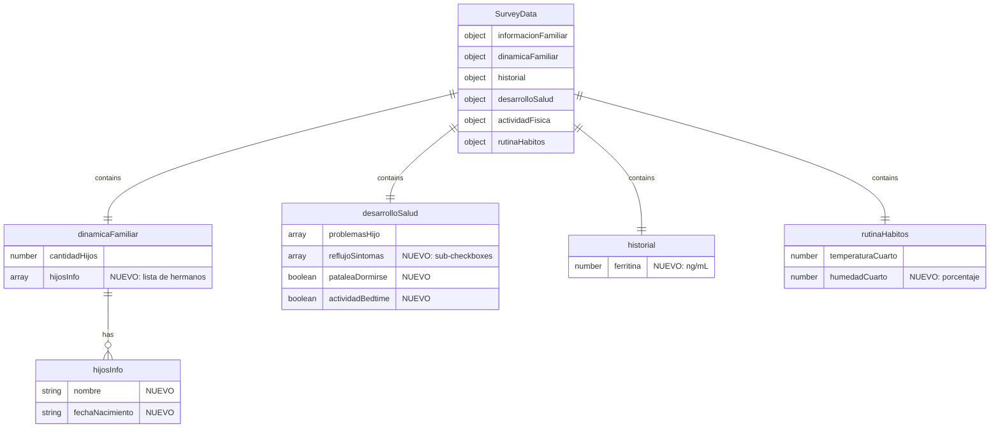

# Sprint 4B: Mejoras al Survey y Analisis LLM del Pasante AI

## Overview

Agregar los campos faltantes al cuestionario (survey) y extender el Pasante AI para analizar texto libre de eventos y chat con LLM, extrayendo informacion relevante para los 4 grupos de validacion del Panel de Diagnostico.

## Problem Statement / Motivation

El Panel de Diagnostico (Item 4) esta funcionando pero varios indicadores medicos estan marcados como `available: false` porque los campos no existen en el survey. Ademas, los padres escriben informacion valiosa en las notas de eventos y el chat que actualmente no se aprovecha para el diagnostico.

**Indicadores pendientes:**
- G2 Reflujo: 5 indicadores sin datos
- G2 Restless Leg: 2 indicadores sin datos
- G4 Ambiental: 1 campo (humedad) sin datos
- Perfil: Hermanos solo tiene cantidad, no detalles
- Perfil: Ferritina no existe

**Oportunidad perdida:**
- Texto libre en eventos y chat contiene informacion medica relevante
- El Pasante AI solo analiza datos estructurados, no texto

## Proposed Solution

### 1. Campos del Survey

| Area | Campo | Tipo | Ubicacion | Estado |
|------|-------|------|-----------|--------|
| G2 Reflujo | Sub-checkboxes condicionales | array de strings | HealthDevStep.tsx | ✅ |
| G2 Restless Leg | 3 checkboxes nuevos | boolean | HealthDevStep.tsx | ✅ |
| G4 Humedad | Campo select (seca/normal/humeda) | string | RoutineHabitsStep.tsx | ✅ |
| Perfil Hermanos | Lista con nombre + fecha | array de objetos | FamilyDynamicsStep.tsx | ✅ |
| Perfil Ferritina | Campo numerico (ng/mL) | number | HealthDevStep.tsx | ✅ |

### 2. Pasante AI Extendido

Modificar el Pasante AI para:
1. ✅ Recibir texto libre de eventos (`notes`) y chat (ultimos 14 dias)
2. ✅ Analizar con LLM para extraer informacion relevante de G1-G4
3. ✅ Ejecutar SOLO on-demand (click en "Analizar")
4. ✅ Mostrar hallazgos del texto libre junto al resumen
5. ✅ Aumentar tokens de 400 a 800

## Technical Considerations

### Arquitectura

**Survey:**
- Patron existente: `updateProblemaHijo()` en HealthDevStep.tsx (linea 29-46)
- Checkboxes condicionales: ya implementado para reflujo detalle (linea 494-516)
- Modelo `hijosInfo` ya existe en types/models.ts (linea 81-88) pero NO en wizard

**Pasante AI:**
- Archivo: `/lib/diagnostic/pasante-ai-prompt.ts`
- Modelo actual: `gpt-4o-mini`, 400 tokens
- Necesita: Aumentar tokens para texto libre (800-1000)
- Input adicional: `eventNotes: string[]`, `chatMessages: string[]`

### Performance

- Analisis LLM es on-demand, no afecta carga inicial
- Hermanos limitados a 10 maximo
- Texto libre truncado a ultimos 14 dias

### Seguridad

- Ferritina es dato medico sensible pero viene del survey del padre
- Admin-only no cambia (panel ya es admin-only)

## Acceptance Criteria

### Funcionales

#### G2 - Checkboxes Reflujo
- [ ] Al marcar "reflujo", aparecen 5 sub-checkboxes
- [ ] Sub-checkboxes se limpian al desmarcar "reflujo"
- [ ] Datos guardados en `surveyData.desarrolloSalud.reflujoSintomas[]`
- [ ] Panel G2 detecta indicadores y muestra alertas

#### G2 - Restless Leg
- [ ] 2 checkboxes nuevos visibles en seccion problemas
- [ ] "Patalea al dormirse" guardado en `surveyData.desarrolloSalud.pataleaDormirse`
- [ ] "Busca actividad fisica en bedtime" guardado en `surveyData.desarrolloSalud.actividadBedtime`
- [ ] Panel G2 detecta indicadores

#### G4 - Humedad
- [ ] Campo numerico despues de temperatura
- [ ] NO obligatorio (puede quedar vacio)
- [ ] Placeholder: "Ej: 50"
- [ ] Rango valido: 0-100 (porcentaje)
- [ ] Panel G4 valida: optimo 40-60%, warning fuera de rango

#### Perfil - Hermanos
- [ ] Boton "Agregar hermano" en FamilyDynamicsStep
- [ ] Campos: Nombre (texto), Fecha nacimiento (date picker)
- [ ] Edad calculada automaticamente y mostrada
- [ ] Boton eliminar por hermano
- [ ] Limite: 10 hermanos maximo
- [ ] Guardado en `surveyData.dinamicaFamiliar.hijosInfo[]`

#### Perfil - Ferritina
- [ ] Campo numerico en HealthDevStep
- [ ] Label: "Nivel de ferritina (ng/mL)"
- [ ] Placeholder: "Ej: 45"
- [ ] NO obligatorio
- [ ] Panel G2 alerta si < 50 ng/mL

#### Pasante AI Extendido
- [ ] Recibe notas de eventos (ultimos 14 dias)
- [ ] Recibe mensajes de chat del usuario (ultimos 14 dias)
- [ ] Analiza con LLM para extraer info de G1-G4
- [ ] Solo se ejecuta al click "Analizar"
- [ ] Muestra hallazgos del texto libre en el resumen

### No Funcionales

- [ ] Build pasa sin errores TypeScript
- [ ] Campos nuevos tienen tipos en `types/models.ts`
- [ ] Indicadores medicos actualizados a `available: true`
- [ ] Validacion defensiva (campos pueden ser undefined)

## Implementation Plan

### Fase 1: Tipos y Modelo de Datos

**Tarea 1.1: Actualizar types/models.ts**
```typescript
// En desarrolloSalud agregar:
reflujoSintomas?: string[]  // ['posicionVertical', 'lloraDespertar', ...]
pataleaDormirse?: boolean
actividadBedtime?: boolean

// En rutinaHabitos agregar:
humedadCuarto?: number  // 0-100 (porcentaje)

// En historial agregar:
ferritina?: number  // ng/mL
```

**Tarea 1.2: Actualizar medical-indicators.ts**
- Cambiar `available: false` a `true` para los 7 indicadores
- Actualizar `surveyField` para mapear a nuevos campos

### Fase 2: UI del Survey - G2 Reflujo

**Tarea 2.1: Checkboxes condicionales de reflujo**
- Archivo: `components/survey/steps/HealthDevStep.tsx`
- Ubicacion: Despues de checkbox "reflujo" existente (linea 516)
- Patron: Seguir `updateProblemaHijo()` existente

```tsx
{data.problemasHijo?.includes("reflujo") && (
  <div className="ml-6 mt-2 space-y-2">
    <Label className="text-sm text-gray-600">Selecciona los sintomas que presenta:</Label>

    <div className="flex items-center space-x-2">
      <Checkbox
        id="reflujo-posicion"
        checked={data.reflujoSintomas?.includes("posicionVertical") || false}
        onCheckedChange={(checked) => updateReflujoSintoma("posicionVertical", checked)}
      />
      <Label htmlFor="reflujo-posicion" className="text-sm">
        Solo tolera estar en posicion vertical
      </Label>
    </div>

    {/* Repetir para los otros 4 sintomas */}
  </div>
)}
```

**Tarea 2.2: Helper para actualizar sintomas de reflujo**
```tsx
const updateReflujoSintoma = (sintoma: string, checked: CheckedState) => {
  const isChecked = checked === true
  const sintomas = data.reflujoSintomas || []
  const nextSintomas = isChecked
    ? [...sintomas, sintoma]
    : sintomas.filter((s: string) => s !== sintoma)

  onChange({ ...data, reflujoSintomas: nextSintomas })
}
```

**Tarea 2.3: Limpiar sintomas al desmarcar reflujo**
- Modificar `updateProblemaHijo` para limpiar `reflujoSintomas` cuando se desmarca

### Fase 3: UI del Survey - G2 Restless Leg

**Tarea 3.1: Checkboxes de Restless Leg**
- Archivo: `components/survey/steps/HealthDevStep.tsx`
- Ubicacion: En seccion problemasHijo, despues de "inquieto"

```tsx
<div className="flex items-center space-x-2">
  <Checkbox
    id="prob-patalea"
    checked={data.pataleaDormirse || false}
    onCheckedChange={(checked) => updateField("pataleaDormirse", checked === true)}
  />
  <Label htmlFor="prob-patalea">Patalea al dormirse</Label>
</div>

<div className="flex items-center space-x-2">
  <Checkbox
    id="prob-actividad"
    checked={data.actividadBedtime || false}
    onCheckedChange={(checked) => updateField("actividadBedtime", checked === true)}
  />
  <Label htmlFor="prob-actividad">Busca actividad fisica en bedtime (caminar, gatear, pararse)</Label>
</div>
```

### Fase 4: UI del Survey - G4 Humedad

**Tarea 4.1: Campo de humedad**
- Archivo: `components/survey/steps/RoutineHabitsStep.tsx`
- Ubicacion: Despues de pregunta de temperatura

```tsx
<div className="space-y-2">
  <Label htmlFor="humedad">Aproximadamente, cual es la humedad del cuarto? (opcional)</Label>
  <div className="flex items-center gap-2">
    <Input
      id="humedad"
      type="number"
      min={0}
      max={100}
      placeholder="Ej: 50"
      value={data.humedadCuarto || ""}
      onChange={(e) => updateField("humedadCuarto", e.target.value ? Number(e.target.value) : undefined)}
      className="w-24"
    />
    <span className="text-sm text-gray-500">%</span>
  </div>
</div>
```

### Fase 5: UI del Survey - Hermanos

**Tarea 5.1: Componente SiblingsList**
- Crear: `components/survey/SiblingsList.tsx`

```tsx
interface Sibling {
  nombre: string
  fechaNacimiento: string
}

interface SiblingsListProps {
  siblings: Sibling[]
  onChange: (siblings: Sibling[]) => void
  maxSiblings?: number
}

export function SiblingsList({ siblings, onChange, maxSiblings = 10 }: SiblingsListProps) {
  const addSibling = () => {
    if (siblings.length >= maxSiblings) return
    onChange([...siblings, { nombre: "", fechaNacimiento: "" }])
  }

  const removeSibling = (index: number) => {
    onChange(siblings.filter((_, i) => i !== index))
  }

  const updateSibling = (index: number, field: keyof Sibling, value: string) => {
    const updated = [...siblings]
    updated[index] = { ...updated[index], [field]: value }
    onChange(updated)
  }

  const calculateAge = (fechaNacimiento: string): string => {
    if (!fechaNacimiento) return ""
    const birth = new Date(fechaNacimiento)
    const now = new Date()
    const months = (now.getFullYear() - birth.getFullYear()) * 12 + (now.getMonth() - birth.getMonth())
    if (months < 24) return `${months} meses`
    const years = Math.floor(months / 12)
    return `${years} anos`
  }

  return (
    <div className="space-y-4">
      {siblings.map((sibling, index) => (
        <div key={index} className="flex items-center gap-4 p-3 bg-gray-50 rounded">
          <Input
            placeholder="Nombre"
            value={sibling.nombre}
            onChange={(e) => updateSibling(index, "nombre", e.target.value)}
            className="flex-1"
          />
          <Input
            type="date"
            value={sibling.fechaNacimiento}
            onChange={(e) => updateSibling(index, "fechaNacimiento", e.target.value)}
            className="w-40"
          />
          {sibling.fechaNacimiento && (
            <span className="text-sm text-gray-500 w-20">{calculateAge(sibling.fechaNacimiento)}</span>
          )}
          <Button variant="ghost" size="sm" onClick={() => removeSibling(index)}>
            <Trash2 className="h-4 w-4" />
          </Button>
        </div>
      ))}

      {siblings.length < maxSiblings && (
        <Button variant="outline" size="sm" onClick={addSibling}>
          <Plus className="h-4 w-4 mr-2" /> Agregar hermano
        </Button>
      )}
    </div>
  )
}
```

**Tarea 5.2: Integrar en FamilyDynamicsStep**
- Archivo: `components/survey/steps/FamilyDynamicsStep.tsx`

```tsx
import { SiblingsList } from "../SiblingsList"

// En el render, despues de "Quienes mas viven en la casa"
<div className="space-y-2">
  <Label>Hermanos del nino</Label>
  <SiblingsList
    siblings={data.hijosInfo || []}
    onChange={(hijosInfo) => onChange({ ...data, hijosInfo })}
  />
</div>
```

### Fase 6: UI del Survey - Ferritina

**Tarea 6.1: Campo de ferritina**
- Archivo: `components/survey/steps/HealthDevStep.tsx`
- Ubicacion: Nueva seccion "Informacion Medica Adicional" al final

```tsx
<div className="space-y-4 mt-6">
  <h3 className="text-lg font-medium">Informacion Medica Adicional</h3>

  <div className="space-y-2">
    <Label htmlFor="ferritina">Nivel de ferritina (ng/mL) - opcional</Label>
    <p className="text-sm text-gray-500">Si el pediatra ha medido la ferritina, ingresa el valor aqui</p>
    <div className="flex items-center gap-2">
      <Input
        id="ferritina"
        type="number"
        min={0}
        max={500}
        placeholder="Ej: 45"
        value={data.ferritina || ""}
        onChange={(e) => updateField("ferritina", e.target.value ? Number(e.target.value) : undefined)}
        className="w-24"
      />
      <span className="text-sm text-gray-500">ng/mL</span>
    </div>
  </div>
</div>
```

### Fase 7: Motor de Validacion - Actualizar Indicadores

**Tarea 7.1: Actualizar medical-indicators.ts**
- Cambiar `available: false` a `available: true` para:
  - `posicionVertical` (linea 57)
  - `lloraDespertar` (linea 65)
  - `vomitaFrecuente` (linea 73)
  - `tomasFrecuentes` (linea 81)
  - `despiertaAsustado` (linea 221)
  - `pataleaDormirse` (linea 297)
  - `actividadBedtime` (linea 305)

- Actualizar `surveyField` para mapear a campos correctos

**Tarea 7.2: Actualizar environmental-rules.ts**
- El factor `humidity` ya existe pero `available: false`
- Cambiar a `available: true`
- Actualizar `surveyField` a `rutinaHabitos.humedadCuarto`

### Fase 8: Pasante AI Extendido

**Tarea 8.1: Actualizar PasanteContext**
- Archivo: `lib/diagnostic/pasante-ai-prompt.ts`

```typescript
export interface PasanteContext {
  // Campos existentes...
  childName: string
  childAgeMonths: number
  planVersion: string
  planStatus: string
  diagnosticResult: DiagnosticResult
  recentEventsCount: number
  surveyDataAvailable: boolean

  // NUEVOS campos para texto libre
  eventNotes: string[]      // Notas de eventos ultimos 14 dias
  chatMessages: string[]    // Mensajes de chat ultimos 14 dias
}
```

**Tarea 8.2: Actualizar prompt del sistema**
- Agregar seccion para analisis de texto libre

```typescript
// En getPasanteSystemPrompt()
const textAnalysisSection = context.eventNotes.length > 0 || context.chatMessages.length > 0
  ? `
TEXTO LIBRE PARA ANALIZAR:

Notas de eventos recientes:
${context.eventNotes.join("\n") || "Sin notas"}

Mensajes del chat:
${context.chatMessages.join("\n") || "Sin mensajes"}

INSTRUCCIONES DE ANALISIS:
Analiza el texto libre y extrae informacion relevante para cada grupo:
- G1 (Horario): Menciones de problemas con siestas, despertares, dificultad para dormir
- G2 (Medico): Sintomas de reflujo, congestion, vomitos, visitas al pediatra, ferritina
- G3 (Alimentacion): Rechazos de comida, problemas con solidos o leche
- G4 (Ambiental): Cambios de rutina, eventos familiares, pantallas, ambiente de sueno

Incluye los hallazgos del texto libre en tu analisis.
`
  : ""
```

**Tarea 8.3: Actualizar PASANTE_AI_CONFIG**
```typescript
export const PASANTE_AI_CONFIG = {
  model: "gpt-4o-mini" as const,
  maxTokens: 800,  // Aumentado de 400 a 800 para texto libre
  temperature: 0.7,
  presencePenalty: 0.1,
  frequencyPenalty: 0.1,
}
```

**Tarea 8.4: Actualizar API endpoint**
- Archivo: `app/api/admin/diagnostics/ai-summary/route.ts`

```typescript
// Despues de obtener el child, agregar:

// Obtener notas de eventos (ultimos 14 dias)
const fourteenDaysAgo = new Date()
fourteenDaysAgo.setDate(fourteenDaysAgo.getDate() - 14)

const recentEvents = await db.collection("events").find({
  childId: new ObjectId(childId),
  createdAt: { $gte: fourteenDaysAgo }
}).toArray()

const eventNotes = recentEvents
  .filter(e => e.notes && e.notes.trim())
  .map(e => `[${e.eventType}] ${e.notes}`)

// Obtener mensajes de chat (ultimos 14 dias)
const chatMessages = await db.collection("chatMessages").find({
  childId: new ObjectId(childId),
  role: "user",
  createdAt: { $gte: fourteenDaysAgo }
}).toArray()

const chatTexts = chatMessages.map(m => m.content)

// Pasar al contexto del Pasante
const pasanteContext: PasanteContext = {
  // ...campos existentes
  eventNotes,
  chatMessages: chatTexts,
}
```

### Fase 9: Validacion y Testing

**Tarea 9.1: Build check**
```bash
pnpm build
```

**Tarea 9.2: Verificar survey con datos nuevos**
- Login como padre
- Editar survey existente
- Verificar campos nuevos aparecen
- Guardar y verificar persistencia

**Tarea 9.3: Verificar Panel de Diagnostico**
- Login como admin
- Ir a `/dashboard/diagnosticos/[childId]`
- Verificar G2 muestra indicadores nuevos
- Verificar G4 muestra humedad
- Click "Analizar" y verificar texto libre en resumen

## Dependencies & Risks

### Dependencias
- Sprint 4A (Panel de Diagnostico) completado
- Modelo `hijosInfo` ya existe en BD
- Indicadores medicos ya definidos en `medical-indicators.ts`

### Riesgos

| Riesgo | Probabilidad | Impacto | Mitigacion |
|--------|--------------|---------|------------|
| Surveys existentes sin nuevos campos | Alta | Bajo | Validacion defensiva (campos opcionales) |
| Tokens insuficientes para texto largo | Media | Medio | Truncar texto a ultimos 14 dias |
| Usuarios no ingresan ferritina | Alta | Bajo | Campo opcional, indicador queda en warning |

## References & Research

### Internal References
- Patron checkboxes: `components/survey/steps/HealthDevStep.tsx:29-46`
- Modelo hermanos: `types/models.ts:81-88`
- Pasante AI: `lib/diagnostic/pasante-ai-prompt.ts:145-191`
- Indicadores medicos: `lib/diagnostic/medical-indicators.ts`

### External References
- Ferritina umbral RLS: [PMC Article](https://pmc.ncbi.nlm.nih.gov/articles/PMC3381661/) - < 50 ng/mL
- Humedad optima sueno: 40-60% (SPEC-SPRINT.md)

### Decisiones de Entrevista
- Primera/segunda parte noche: Antes/despues de medianoche
- Registro medico: Analisis LLM de texto libre on-demand
- Ferritina umbral: < 50 ng/mL
- Checkboxes reflujo: Sub-checkboxes condicionales
- Hermanos: Nombre + fecha nacimiento (edad calculada)
- Humedad: NO obligatoria, rango 40-60% optimo

---

## ERD - Cambios al Modelo



---

*Plan generado el 2026-02-04 basado en decisiones de entrevista y analisis del codebase.*
