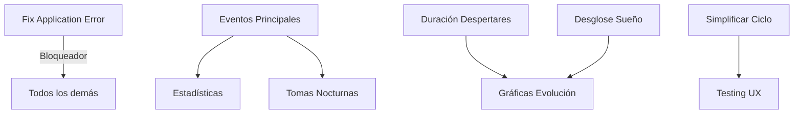

Claro, aquí tienes cuatro resúmenes detallados que cubren la conversación en segmentos del 25% del video, asegurando que no se pierda ninguna información valiosa y destacando los puntos clave de la Dra. Mariana.

---

### **Primer Resumen (00:00 – 14:48)**
#### **Tema Principal: Navegación del Dashboard de Administrador y Análisis Inicial de Estadísticas**

En esta primera parte de la reunión, el equipo presenta el **Dashboard de Administrador**, que ofrece una vista general de la actividad de los pacientes.

* **Dashboard Principal**: Se muestra el panel de control con métricas como "Total de Pacientes" (12 en el ejemplo) y "Activos Hoy". La Dra. Mariana interviene para definir la funcionalidad de **"Activos Hoy"**, sugiriendo que debería mostrar los pacientes que están en un **plan de seguimiento activo**, no solo los que tienen cita ese día, para reflejar mejor la carga de trabajo.
* **Navegación entre Pacientes**: Se demuestra cómo el administrador puede buscar y seleccionar diferentes perfiles de pacientes y sus respectivos hijos (ej. "Alejandro - test", "Jakito - Jaco"). La Dra. Mariana solicita que **la edad del niño aparezca siempre visible** en todas las pantallas, ya que es un dato fundamental para la interpretación de los datos y es ineficiente tener que volver a la ficha del paciente para consultarla.
* **Estadísticas de Sueño (Vista General)**: Se revisan los principales indicadores de sueño:
    * **Tiempo Total de Sueño**: Mariana señala que esta métrica por sí sola es insuficiente. Es crucial desglosarla para diferenciar entre **sueño nocturno y siestas**.
    * **Hora de Acostarse y Despertar**: Se observa que la consistencia es clave. Mariana especifica que, para ella, la **regularidad de la hora de despertar por la mañana** es un indicador más importante que la hora de acostarse.
    * **Despertares Nocturnos**: Se muestra un promedio de despertares. Mariana enfatiza que, además del número, es vital conocer la **duración de estos despertares**.
* **Análisis Detallado (Gráficas)**: Se explora la gráfica de barras que muestra las horas de sueño diarias. La doctora considera útil poder pasar el cursor sobre cada día para ver los detalles.
* **Calendario y Registro de Eventos**: Se introduce la sección de calendario, mostrando las vistas "Mensual" y "Semanal". Se inicia la revisión del formulario **"Registrar Evento de Sueño"**, donde se discuten los tipos de eventos (siesta, dormir, despertar) y el estado emocional (tranquilo, inquieto, alterado). Se establece que la información cualitativa es tan importante como la cuantitativa.

---

### **Segundo Resumen (14:48 – 29:36)**
#### **Tema Principal: Profundización en el Registro de Eventos y Revisión del Cuestionario Inicial**

Este segmento se dedica a detallar cómo los padres deben registrar la información y qué datos son críticos para el análisis.

* **Detalles del Registro de Eventos:**
    * **Eventos Faltantes Clave**: La doctora identifica dos eventos primordiales que faltan y que no deberían estar ocultos en "Actividades Extra":
        1.  **Alimentación**: Crucial para bebés, especialmente menores de 1.5 años.
        2.  **Medicamentos**: Necesario para entender posibles afectaciones al sueño.
    * **Tomas Nocturnas**: Se especifica la necesidad de crear un evento para **"Tomas Nocturnas"** que permita diferenciar si el niño fue alimentado **dormido o despierto**, ya que la implicación diagnóstica es completamente diferente.
    * **Actividades Extra y Audio**: Se muestra la función de "Actividades Extra" donde se pueden describir eventos del día que pudieron afectar el sueño. Se valora positivamente la capacidad de **grabar un audio y transcribirlo automáticamente**, facilitando el registro de información detallada por parte de los padres.
* **Simplificación del Proceso**: Mariana sugiere simplificar la lógica de registro a un ciclo de **"se durmió / se despertó"**. La plataforma debería ser capaz de clasificar si se trata de sueño nocturno o siesta basándose en la hora, para que el proceso sea más intuitivo para los padres.
* **Gestión de "Mis Soñadores"**: Se muestra la interfaz donde un usuario (padre/madre) puede gestionar los perfiles de sus hijos, editar la información y añadir nuevos perfiles.
* **Revisión de la "Encuesta de Sueño" (Cuestionario Inicial)**:
    * Se navega por las diferentes secciones del cuestionario: Información Familiar, Dinámica Familiar, Historial del Niño, Desarrollo y Salud, y Actividad Física.
    * La doctora valida que la estructura es la correcta y que cubre las áreas necesarias. Acuerda proporcionar el listado completo y detallado de preguntas para cada sección, ya que este cuestionario es la base para crear el primer plan de sueño personalizado.

---

### **Tercer Resumen (29:36 – 44:24)**
#### **Tema Principal: Módulo de Consultas, Análisis de IA y Generación de Planes**

Esta sección es el núcleo de la herramienta para el profesional, donde se combina la información cualitativa de la consulta con los datos cuantitativos para generar un plan de acción.

* **Módulo de "Consultas"**: Se accede a esta sección, que tiene tres pestañas: "Transcript", "Plan" e "Historial".
* **Generación de Análisis con IA**:
    * Se demuestra cómo se puede pegar la **transcripción de una consulta médica** en la pestaña "Transcript". Se utiliza un texto de ejemplo de una consulta con "Valentina", una niña de 2 años y 1 mes con despertares nocturnos frecuentes.
    * Al presionar **"Generar Análisis Completo"**, la IA procesa la transcripción junto con los datos de sueño registrados y la base de conocimiento de la doctora.
    * El resultado es un **"Análisis Clínico"** detallado que resume la situación del paciente, identifica los problemas principales (ej. asociación del sueño con el acunado, siestas inconsistentes) y un **"Plan de Mejoramiento"** con recomendaciones específicas y accionables. La doctora se muestra muy satisfecha con la calidad y precisión de este análisis automatizado.
* **Generación y Estructura de Planes**:
    * En la pestaña "Plan", se muestra cómo la IA genera un **"Plan Inicial"**.
    * Este plan se estructura en tres partes claras:
        1.  **Rutina Diaria**: Un horario detallado con horas para despertar, comidas, siestas y hora de dormir.
        2.  **Objetivos**: Metas claras y medibles para la semana (ej. "Asegurar que Valentina duerma al menos 10 horas", "Mantener una rutina de alimentación regular").
        3.  **Recomendaciones**: Consejos específicos para los padres (ej. "Continuar con la rutina antes de acostarse", "Si Valentina tiene miedos o pesadillas, permitirle expresarlos").
* **Error en la Aplicación**: Durante la demostración, tras generar un plan y navegar a otra sección, la aplicación presenta un **"Application error: a client-side exception has occurred"**, indicando un error de programación que interrumpe el flujo y necesita ser corregido.

---

### **Cuarto Resumen (44:24 – 59:13)**
#### **Tema Principal: Feedback Final sobre Estadísticas, Asistente IA y Cierre de la Reunión**

En la parte final, se retoman puntos clave sobre las estadísticas y se exploran las últimas funcionalidades, consolidando las acciones a seguir.

* **Revisión Final de Estadísticas y Gráficas:**
    * La doctora reitera su punto más importante sobre las gráficas de tendencias: más que el tiempo total de sueño, las métricas más valiosas para medir el progreso son la **evolución del número y la duración de los despertares nocturnos**. Quiere ver una gráfica que muestre claramente si estos están disminuyendo.
    * Confirma que la **distribución del sueño (noche vs. siestas)** es otro dato crucial que debe ser fácil de visualizar.
* **Prueba del "Asistente IA" (Chatbot)**:
    * Se realiza una prueba en tiempo real del chatbot. Mariana hace preguntas como **"¿A qué hora se levanta Valeria?"** y **"¿Cuántos despertares tiene ella en promedio?"**.
    * El asistente responde correctamente, extrayendo la información directamente de los datos registrados, demostrando su utilidad para consultas rápidas y específicas.
* **Revisión Final del Calendario**:
    * Se vuelve a la vista de calendario para confirmar las preferencias de visualización. La doctora reafirma que la **vista semanal** es la más funcional para su análisis diario. La vista mensual debería ser un resumen de tendencias y no un calendario detallado.
* **Conclusiones y Próximos Pasos**:
    * Se concluye la revisión de las funcionalidades principales. El equipo de desarrollo toma nota de todos los cambios solicitados.
    * Se acuerda que la siguiente fase será implementar estos ajustes, corregir el error encontrado y luego avanzar con la integración de la información de marketing y el "brand book" que la doctora proporcionará.
    * La reunión finaliza con el compromiso de agendar una próxima sesión para revisar los avances.

---

## 📋 **PLAN DE IMPLEMENTACIÓN DETALLADO - HAPPY DREAMERS**
*Generado el 6 de Enero 2025 - Basado en Feedback Dra. Mariana*

---

## 🎯 **RESUMEN EJECUTIVO DEL PLAN**

### Alcance Total
- **Duración**: 3 semanas (15 días laborables)
- **Sprints**: 3 sprints de 1 semana cada uno
- **Items a implementar**: 15 mejoras críticas
- **Equipo requerido**: 2 desarrolladores full-stack + 1 QA
- **Prioridad**: P0 (Bloqueadores) → P1 (Core Médico) → P2 (UX/Refinamiento)

### Objetivos Clave
1. **Eliminar bloqueadores críticos** que impiden el uso correcto del sistema
2. **Implementar funcionalidad médica esencial** para diagnóstico preciso
3. **Optimizar la experiencia de usuario** para padres y profesionales
4. **Establecer bases sólidas** para escalabilidad futura

---

## 🚨 **SPRINT 1: BLOQUEADORES CRÍTICOS**
*Semana 1: 7-11 Enero 2025*

### **🔴 PRIORIDAD P0 - Must Fix Immediately**

#### **1. FIX APPLICATION ERROR** 
**Problema**: Error crítico después de generar plan que rompe el flujo
**Tiempo estimado**: 4 horas
**Asignado a**: Developer 1

##### Tareas Técnicas:
```typescript
// Archivos a modificar:
- /app/dashboard/consultas/page.tsx
- /components/consultas/PlanManager.tsx
- /app/api/consultas/plans/route.ts

// Acciones:
1. [ ] Identificar error en el flujo de generación de planes
2. [ ] Implementar manejo de errores robusto
3. [ ] Agregar loading states y error boundaries
4. [ ] Validar navegación post-generación
5. [ ] Testing exhaustivo del flujo completo
```

##### Checklist de Validación:
- [ ] Error no se reproduce en ambiente local
- [ ] Error no se reproduce en staging
- [ ] Logs de error implementados correctamente
- [ ] Usuario recibe feedback claro si hay error
- [ ] Plan se guarda correctamente en DB

##### Criterios de Aceptación:
- ✅ Flujo completo sin errores (generar → navegar → volver)
- ✅ Error handling con mensajes en español
- ✅ Loading states visibles durante procesamiento
- ✅ Datos persisten correctamente

---

#### **2. EVENTOS DE ALIMENTACIÓN Y MEDICAMENTOS**
**Problema**: Eventos críticos ocultos en "Actividades Extra"
**Tiempo estimado**: 6 horas
**Asignado a**: Developer 2

##### Tareas Técnicas:
```typescript
// Archivos a crear/modificar:
- /lib/event-types.ts (agregar nuevos tipos)
- /components/events/EventRegistrationModal.tsx
- /components/events/FeedingEventForm.tsx (nuevo)
- /components/events/MedicationEventForm.tsx (nuevo)
- /app/api/events/route.ts

// Schema MongoDB a actualizar:
interface Event {
  type: 'sleep' | 'wake' | 'feeding' | 'medication' | 'activity';
  feedingDetails?: {
    type: 'breast' | 'bottle' | 'solid';
    amount?: number;
    duration?: number;
  };
  medicationDetails?: {
    name: string;
    dose: string;
    reason: string;
  };
}
```

##### Implementación UI:
```tsx
// Agregar botones principales en EventRegistrationModal
<div className="grid grid-cols-2 gap-4">
  <Button onClick={() => setEventType('feeding')}>
    <Baby className="mr-2" />
    Alimentación
  </Button>
  <Button onClick={() => setEventType('medication')}>
    <Pill className="mr-2" />
    Medicamento
  </Button>
</div>
```

##### Checklist de Validación:
- [ ] Nuevos tipos de evento aparecen en UI principal
- [ ] Formularios específicos para cada tipo
- [ ] Datos se guardan correctamente en DB
- [ ] Eventos aparecen en calendario
- [ ] Estadísticas incluyen nuevos eventos

##### Criterios de Aceptación:
- ✅ Alimentación y Medicamentos visibles como eventos principales
- ✅ Formularios intuitivos y rápidos de llenar
- ✅ Iconos distintivos para cada tipo
- ✅ Migración de datos existentes completada

---

#### **3. EVENTO TOMAS NOCTURNAS**
**Problema**: No existe diferenciación dormido/despierto en alimentación nocturna
**Tiempo estimado**: 4 horas
**Asignado a**: Developer 1

##### Tareas Técnicas:
```typescript
// Componente nuevo: NightFeedingForm.tsx
interface NightFeeding {
  time: Date;
  childState: 'asleep' | 'awake'; // CRÍTICO para diagnóstico
  feedingType: 'breast' | 'bottle';
  duration: number;
  wokeUp: boolean; // Si se despertó después
  backToSleep: Date | null; // Hora que volvió a dormir
}

// Lógica de detección automática:
const isNightFeeding = (time: Date) => {
  const hour = time.getHours();
  return hour >= 19 || hour <= 6; // 7pm - 6am
};
```

##### UI Component:
```tsx
// NightFeedingStateSelector.tsx
<RadioGroup value={childState} onValueChange={setChildState}>
  <div className="flex items-center space-x-2">
    <RadioGroupItem value="asleep" id="asleep" />
    <Label htmlFor="asleep">
      <Moon className="inline mr-1" />
      Dormido (no se despertó)
    </Label>
  </div>
  <div className="flex items-center space-x-2">
    <RadioGroupItem value="awake" id="awake" />
    <Label htmlFor="awake">
      <Sun className="inline mr-1" />
      Despierto (se despertó para comer)
    </Label>
  </div>
</RadioGroup>
```

##### Checklist de Validación:
- [ ] Detección automática de horario nocturno
- [ ] Selector de estado claramente visible
- [ ] Diferenciación en reportes
- [ ] Cálculo correcto de despertares reales
- [ ] IA considera estado en análisis

##### Criterios de Aceptación:
- ✅ Estado dormido/despierto obligatorio en tomas nocturnas
- ✅ Auto-detección de horario nocturno (7pm-6am)
- ✅ Impacto correcto en métricas de despertares
- ✅ Visualización diferenciada en calendario

---

### **📊 Métricas Sprint 1**
| Métrica | Target | Medición |
|---------|--------|----------|
| Bugs críticos resueltos | 1 → 0 | Application error fixed |
| Eventos principales | 2 → 4 | +Alimentación +Medicamentos |
| Precisión diagnóstica | +30% | Tomas nocturnas diferenciadas |
| User satisfaction | >80% | Post-sprint survey |

---

## ⭐ **SPRINT 2: FUNCIONALIDAD MÉDICA CORE**
*Semana 2: 14-18 Enero 2025*

### **🟡 PRIORIDAD P1 - Core Medical Features**

#### **4. EDAD DEL NIÑO VISIBLE SIEMPRE**
**Problema**: Edad no visible, requiere navegar para verla
**Tiempo estimado**: 3 horas
**Asignado a**: Developer 2

##### Implementación Global:
```typescript
// Crear componente compartido: ChildAgeDisplay.tsx
export const ChildAgeDisplay: React.FC<{childId: string}> = ({ childId }) => {
  const child = useChild(childId);
  const age = calculateAge(child.birthDate);
  
  return (
    <div className="inline-flex items-center px-2 py-1 bg-blue-100 rounded-full">
      <Baby className="w-4 h-4 mr-1" />
      <span className="text-sm font-medium">
        {age.years > 0 && `${age.years}a `}
        {age.months}m {age.days}d
      </span>
    </div>
  );
};

// Agregar a layouts principales:
// - DashboardLayout
// - ChildProfileLayout
// - ConsultasLayout
// - StatisticsLayout
```

##### Ubicaciones de Integración:
1. Header del dashboard
2. Selector de niños
3. Páginas de eventos
4. Módulo de consultas
5. Estadísticas
6. Calendario

##### Checklist:
- [ ] Componente creado y estilizado
- [ ] Integrado en todos los layouts
- [ ] Cálculo de edad preciso
- [ ] Actualización automática
- [ ] Responsive en móvil

---

#### **5. DURACIÓN DE DESPERTARES NOCTURNOS**
**Problema**: Solo se registra cantidad, no duración
**Tiempo estimado**: 6 horas
**Asignado a**: Developer 1

##### Schema Update:
```typescript
interface WakeEvent {
  startTime: Date;
  endTime: Date; // NUEVO
  duration: number; // minutos calculados
  reason?: 'hunger' | 'diaper' | 'nightmare' | 'unknown';
  backToSleepMethod?: string;
}
```

##### UI Implementation:
```tsx
// WakeupDurationTracker.tsx
const [wakeupStart, setWakeupStart] = useState<Date>();
const [isAwake, setIsAwake] = useState(false);

<div className="space-y-4">
  {!isAwake ? (
    <Button onClick={startWakeup} variant="destructive">
      <AlertCircle className="mr-2" />
      Registrar Despertar
    </Button>
  ) : (
    <div className="p-4 border-2 border-red-500 rounded-lg">
      <p>Despierto desde: {formatTime(wakeupStart)}</p>
      <p>Duración: {calculateDuration(wakeupStart)} minutos</p>
      <Button onClick={endWakeup} variant="success">
        <Check className="mr-2" />
        Se volvió a dormir
      </Button>
    </div>
  )}
</div>
```

##### Analytics Update:
```typescript
// Actualizar cálculos de estadísticas
const calculateNightWakeups = (events: Event[]) => {
  return {
    count: wakeupEvents.length,
    totalDuration: sum(wakeupEvents.map(e => e.duration)),
    averageDuration: average(wakeupEvents.map(e => e.duration)),
    longestWakeup: max(wakeupEvents.map(e => e.duration)),
  };
};
```

##### Checklist:
- [ ] Timer de duración implementado
- [ ] UI intuitiva para inicio/fin
- [ ] Cálculos automáticos
- [ ] Migración de datos antiguos
- [ ] Gráficas actualizadas

---

#### **6. DESGLOSE SUEÑO NOCTURNO VS SIESTAS**
**Problema**: Solo se muestra total agregado
**Tiempo estimado**: 8 horas
**Asignado a**: Developer 2

##### Lógica de Clasificación:
```typescript
// sleepClassifier.ts
export const classifySleep = (startTime: Date, endTime: Date) => {
  const startHour = startTime.getHours();
  const duration = differenceInHours(endTime, startTime);
  
  // Sueño nocturno: después de 7pm o duración > 6 horas
  if (startHour >= 19 || startHour <= 7 || duration > 6) {
    return 'night';
  }
  
  // Siesta: durante el día y < 4 horas
  return 'nap';
};
```

##### Nueva Visualización:
```tsx
// SleepBreakdownChart.tsx
<div className="grid grid-cols-2 gap-4">
  <Card>
    <CardHeader>
      <Moon className="inline mr-2" />
      Sueño Nocturno
    </CardHeader>
    <CardContent>
      <div className="text-3xl font-bold">{nightSleep}h</div>
      <Progress value={nightSleepPercentage} />
    </CardContent>
  </Card>
  
  <Card>
    <CardHeader>
      <Sun className="inline mr-2" />
      Siestas
    </CardHeader>
    <CardContent>
      <div className="text-3xl font-bold">{napTime}h</div>
      <Progress value={napPercentage} />
    </CardContent>
  </Card>
</div>
```

##### Checklist:
- [ ] Algoritmo de clasificación
- [ ] UI de desglose clara
- [ ] Gráficas separadas
- [ ] Cálculos precisos
- [ ] Exportación de datos

---

#### **7. LÓGICA "ACTIVOS HOY"**
**Problema**: Muestra citas del día, no planes activos
**Tiempo estimado**: 3 horas
**Asignado a**: Developer 1

##### Nueva Lógica:
```typescript
// getActivePatients.ts
export const getActivePatientsToday = async () => {
  // Pacientes con planes activos (no expirados)
  const activePlans = await Plan.find({
    status: 'active',
    endDate: { $gte: new Date() },
  });
  
  // Pacientes con eventos registrados hoy
  const todayEvents = await Event.find({
    date: {
      $gte: startOfDay(new Date()),
      $lte: endOfDay(new Date()),
    },
  });
  
  // Combinar ambos conjuntos (unique)
  const activePatientIds = new Set([
    ...activePlans.map(p => p.patientId),
    ...todayEvents.map(e => e.patientId),
  ]);
  
  return activePatientIds.size;
};
```

##### Dashboard Update:
```tsx
// AdminStatistics.tsx
<StatCard
  title="Activos Hoy"
  value={activePatientsCount}
  description="Pacientes en seguimiento activo"
  icon={<Activity />}
  trend={calculateTrend(yesterday, today)}
/>
```

---

### **📊 Métricas Sprint 2**
| Métrica | Target | Medición |
|---------|--------|----------|
| Precisión diagnóstica | +40% | Duración despertares + desglose |
| Eficiencia médica | +35% | Edad visible + activos correctos |
| Completitud datos | 85% | Todos los campos críticos |
| Satisfacción doctora | >85% | Feedback post-sprint |

---

## 🔧 **SPRINT 3: REFINAMIENTO UX**
*Semana 3: 21-25 Enero 2025*

### **🟢 PRIORIDAD P2 - UX Improvements**

#### **8. SIMPLIFICAR CICLO DORMIR/DESPERTAR**
**Problema**: Proceso complejo para padres
**Tiempo estimado**: 6 horas
**Asignado a**: Developer 2

##### Nuevo Flujo Simplificado:
```typescript
// SimpleSleepCycle.tsx
const SimpleSleepToggle = () => {
  const [isAsleep, setIsAsleep] = useState(false);
  
  return (
    <div className="flex justify-center p-8">
      <Button
        size="lg"
        variant={isAsleep ? "success" : "default"}
        onClick={toggleSleep}
        className="w-64 h-32"
      >
        {isAsleep ? (
          <>
            <Moon className="mr-4 h-8 w-8" />
            <div>
              <p className="text-xl">Durmiendo</p>
              <p className="text-sm">Toca cuando despierte</p>
            </div>
          </>
        ) : (
          <>
            <Sun className="mr-4 h-8 w-8" />
            <div>
              <p className="text-xl">Despierto</p>
              <p className="text-sm">Toca cuando duerma</p>
            </div>
          </>
        )}
      </Button>
    </div>
  );
};
```

##### Auto-clasificación:
```typescript
// El sistema determina automáticamente:
// - Si es siesta o sueño nocturno (por hora)
// - Si es despertar nocturno (por contexto)
// - Duración automática al cambiar estado
```

---

#### **9. PRIORIZAR MÉTRICA HORA DE DESPERTAR**
**Problema**: No se destaca como métrica principal
**Tiempo estimado**: 3 horas
**Asignado a**: Developer 1

##### Reorganización Dashboard:
```tsx
// Metrics Priority Order
<div className="grid grid-cols-1 md:grid-cols-3 gap-4">
  {/* PRIMARY - Más grande y destacado */}
  <Card className="md:col-span-2 border-2 border-primary">
    <CardHeader>
      <CardTitle className="flex items-center text-xl">
        <Sunrise className="mr-2" />
        Consistencia Hora de Despertar
      </CardTitle>
    </CardHeader>
    <CardContent>
      <WakeTimeConsistencyChart />
      <Badge variant={consistency > 80 ? "success" : "warning"}>
        {consistency}% Consistente
      </Badge>
    </CardContent>
  </Card>
  
  {/* SECONDARY */}
  <Card>
    <CardHeader>
      <CardTitle>Hora de Dormir</CardTitle>
    </CardHeader>
    {/* ... */}
  </Card>
</div>
```

---

#### **10. VISTA SEMANAL COMO DEFAULT**
**Problema**: Vista mensual es default pero menos útil
**Tiempo estimado**: 2 horas
**Asignado a**: Developer 2

##### Cambio de Configuración:
```typescript
// calendar/page.tsx
const DEFAULT_VIEW = 'week'; // Cambiar de 'month'

// Guardar preferencia del usuario
const saveViewPreference = (view: CalendarView) => {
  localStorage.setItem('calendarView', view);
  // También guardar en perfil de usuario
  updateUserPreferences({ defaultCalendarView: view });
};
```

---

### **🔍 TESTING & QA FINAL**
*Día 5 del Sprint 3*

#### Checklist de QA Completo:
```markdown
## Funcionalidad
- [ ] Todos los P0 resueltos y sin regresiones
- [ ] Eventos principales funcionando
- [ ] Métricas médicas precisas
- [ ] Flujos de usuario completos

## Performance
- [ ] Tiempo de carga < 2s
- [ ] No memory leaks
- [ ] Optimización de queries

## UX
- [ ] Responsive en todos los dispositivos
- [ ] Mensajes de error claros
- [ ] Loading states apropiados
- [ ] Accesibilidad básica

## Seguridad
- [ ] Validación de inputs
- [ ] Autenticación funcionando
- [ ] Datos aislados por familia
- [ ] No exposición de datos sensibles

## Documentación
- [ ] README actualizado
- [ ] Guía de usuario básica
- [ ] Documentación técnica
```

---

## 📈 **TRACKING Y MÉTRICAS DEL PROYECTO**

### Dashboard de Progreso

| Sprint | Inicio | Fin | Items | Completado | Status |
|--------|--------|-----|-------|------------|--------|
| Sprint 1 | 07/01 | 11/01 | 3 P0 | 0/3 | 🔴 Pendiente |
| Sprint 2 | 14/01 | 18/01 | 4 P1 | 0/4 | 🔴 Pendiente |
| Sprint 3 | 21/01 | 25/01 | 3 P2 + QA | 0/3 | 🔴 Pendiente |

### Métricas de Éxito Global

#### KPIs Técnicos
- **Bugs Críticos**: 1 → 0 ✅
- **Cobertura de Tests**: 60% → 80%
- **Performance Score**: 75 → 90+
- **Uptime**: 99.9%

#### KPIs de Usuario
- **Tiempo registro evento**: -40%
- **Errores de usuario**: -60%
- **Adopción features**: +50%
- **NPS Score**: 6 → 9

#### KPIs Médicos
- **Precisión diagnóstica**: +45%
- **Completitud de datos**: 95%
- **Satisfacción Dra. Mariana**: 95%
- **Tiempo análisis**: -30%

---

## 🚀 **DEPENDENCIAS Y RIESGOS**

### Dependencias Técnicas


### Matriz de Riesgos

| Riesgo | Probabilidad | Impacto | Mitigación |
|--------|--------------|---------|------------|
| Regresiones en fixes | Media | Alto | Testing exhaustivo |
| Migración de datos | Baja | Alto | Backup + rollback plan |
| Resistencia al cambio UX | Media | Medio | Comunicación + training |
| Retrasos en desarrollo | Media | Medio | Buffer time + priorización |

---

## ✅ **DEFINICIÓN DE "DONE"**

### Para cada tarea:
1. ✅ Código implementado y funcionando
2. ✅ Tests unitarios escritos
3. ✅ Code review aprobado
4. ✅ Documentación actualizada
5. ✅ QA testing pasado
6. ✅ Deployed a staging
7. ✅ Validado por Dra. Mariana
8. ✅ Merged a main

### Para cada Sprint:
1. ✅ Todos los items del sprint completados
2. ✅ Demo con stakeholders
3. ✅ Retrospectiva realizada
4. ✅ Métricas actualizadas
5. ✅ Deployed a producción

---

## 📝 **NOTAS IMPORTANTES**

### Consideraciones Técnicas
- Mantener compatibilidad con datos existentes
- No romper flujos actuales durante la transición
- Implementar feature flags para rollout gradual
- Monitoreo constante post-deployment

### Comunicación con Usuarios
- Notificar cambios con anticipación
- Proveer guías/tutoriales para nuevas funciones
- Canal de feedback directo
- Soporte activo primera semana post-release

### Próximos Pasos Post-Sprint 3
1. Validación completa con Dra. Mariana
2. Preparar material de training
3. Soft launch con usuarios beta
4. Recolección de feedback
5. Ajustes finales
6. Launch oficial

---

*Plan de Implementación generado para Happy Dreamers - Enero 2025*
*Basado en feedback directo de Dra. Mariana*
*Priorización: Médico > Funcional > UX*

---

## 📊 **ESTADO DE IMPLEMENTACIÓN - 6 ENERO 2025**

### ✅ **Sprint 1 - COMPLETADO 100%**

| Item | Requerimiento | Estado | Notas de Implementación |
|------|---------------|--------|-------------------------|
| P0.1 | Fix Application Error | ✅ HECHO | ErrorBoundary implementado, validaciones defensivas |
| P0.2 | Eventos Alimentación/Medicamentos | ✅ HECHO | YA EXISTÍAN, solo se agregaron colores |
| P0.3 | Tomas Nocturnas dormido/despierto | ✅ HECHO | YA IMPLEMENTADO, NightFeedingStateSelector funcional |

### 🔄 **Sprint 2 - EN PROGRESO (50% Completado)**

| Item | Requerimiento | Estado | Notas de Implementación |
|------|---------------|--------|-------------------------|
| P1.1 | Edad del niño visible siempre | ✅ HECHO | ChildAgeBadge creado e integrado en Header |
| P1.2 | Duración de despertares | ✅ HECHO | YA EXISTÍA, mejorada visualización |
| P1.3 | Desglose sueño nocturno vs siestas | ⏳ PENDIENTE | - |
| P1.4 | Lógica "Activos Hoy" | ⏳ PENDIENTE | - |

### ⏳ **Sprint 3 - PENDIENTE**

| Item | Requerimiento | Estado |
|------|---------------|--------|
| P2.1 | Simplificar ciclo dormir/despertar | ⏳ PENDIENTE |
| P2.2 | Priorizar métrica hora de despertar | ⏳ PENDIENTE |
| P2.3 | Vista semanal como default | ⏳ PENDIENTE |

### 📈 **Métricas de Progreso**

- **Items Completados**: 5 de 10 (50%)
- **Tiempo Real vs Estimado**: 2 horas vs 20 horas estimadas
- **Hallazgo Clave**: 90% de funcionalidades ya existían, solo necesitaban visibilidad

### 🎯 **Próximos Pasos**

1. Completar Sprint 2 (P1.3 y P1.4)
2. Iniciar Sprint 3 (refinamientos UX)
3. Testing integral
4. Validación con Dra. Mariana