# Happy Dreamers - Workflow Técnico Detallado 🔧

Este documento explica en detalle cómo funciona el proyecto Happy Dreamers desde una perspectiva técnica, incluyendo flujos de datos, arquitectura de componentes, y procesos internos para que cualquier programador pueda entender y trabajar con el sistema.

## 📋 Tabla de Contenidos

1. [Arquitectura General](#arquitectura-general)
2. [Flujo de Autenticación](#flujo-de-autenticación)
3. [Sistema de Gestión de Datos](#sistema-de-gestión-de-datos)
4. [Sistema RAG e IA](#sistema-rag-e-ia)
5. [Sistema de Encuestas](#sistema-de-encuestas)
6. [Dashboard y Visualización](#dashboard-y-visualización)
7. [API Routes y Endpoints](#api-routes-y-endpoints)
8. [Gestión de Estado](#gestión-de-estado)
9. [Generación de Reportes](#generación-de-reportes)
10. [Patrones de Desarrollo](#patrones-de-desarrollo)

## 🏗️ Arquitectura General

### Stack Principal
```
┌─────────────────────────────────────────────┐
│                Frontend                      │
│  Next.js 15 + React 19 + TypeScript        │
│  App Router + Server Components             │
│  Tailwind CSS + shadcn/ui                  │
└─────────────────────────────────────────────┘
                      │
                      ▼
┌─────────────────────────────────────────────┐
│              Authentication                  │
│  NextAuth.js + JWT + MongoDB Adapter       │
│  Role-based Access Control                 │
└─────────────────────────────────────────────┘
                      │
                      ▼
┌─────────────────────────────────────────────┐
│               API Layer                     │
│  Next.js API Routes + Middleware           │
│  Zod Validation + Error Handling           │
└─────────────────────────────────────────────┘
                      │
                      ▼
┌─────────────────────────────────────────────┐
│            Database Layer                   │
│  MongoDB + Vector Store                     │
│  Collections: users, children, events      │
└─────────────────────────────────────────────┘
                      │
                      ▼
┌─────────────────────────────────────────────┐
│              AI/ML Layer                    │
│  OpenAI GPT-4 + LangChain + LangGraph      │
│  Multi-Agent System + RAG                  │
└─────────────────────────────────────────────┘
```

### Estructura de Directorios Explicada

```
happy_dreamers_v0/
├── app/                          # Next.js App Router
│   ├── api/                      # API Routes (Server-side)
│   │   ├── auth/                 # Autenticación
│   │   ├── children/             # CRUD de niños
│   │   ├── events/               # Gestión de eventos
│   │   ├── rag/                  # Sistema de IA
│   │   └── survey/               # Encuestas dinámicas
│   ├── dashboard/                # App protegida
│   │   ├── layout.tsx            # Layout con sidebar
│   │   ├── page.tsx              # Dashboard principal
│   │   ├── children/             # Gestión de niños
│   │   ├── calendar/             # Vista de calendario
│   │   ├── stats/                # Estadísticas
│   │   └── assistant/            # Chat con IA
│   ├── auth/                     # Páginas de autenticación
│   ├── layout.tsx                # Layout raíz
│   └── page.tsx                  # Landing page
├── components/                   # Componentes React
│   ├── ui/                       # Componentes base (shadcn/ui)
│   ├── dashboard/                # Componentes del dashboard
│   ├── auth-provider.tsx         # Provider de autenticación
│   └── theme-provider.tsx        # Provider de tema
├── lib/                          # Utilidades y configuraciones
│   ├── auth.ts                   # Configuración NextAuth
│   ├── mongodb.ts                # Conexión DB
│   ├── utils.ts                  # Utilidades generales
│   └── rag/                      # Sistema de IA
├── context/                      # Contextos de React
└── hooks/                        # Hooks personalizados
```

## 🔐 Flujo de Autenticación

### 1. Configuración de NextAuth.js

**Archivo: `/lib/auth.ts`**

```typescript
// Configuración principal de autenticación
export const authOptions: NextAuthOptions = {
  adapter: MongoDBAdapter(clientPromise),
  session: { strategy: "jwt" },
  providers: [
    CredentialsProvider({
      // Autenticación por email/password
      async authorize(credentials) {
        // 1. Conectar a MongoDB
        const { db } = await connectToDatabase()
        
        // 2. Buscar usuario por email
        const user = await db.collection("users").findOne({
          email: credentials.email,
        })
        
        // 3. Verificar contraseña con bcrypt
        const isPasswordValid = await compare(
          credentials.password, 
          user.password
        )
        
        // 4. Retornar usuario con rol
        return {
          id: user._id.toString(),
          email: user.email,
          name: user.name,
          role: user.role, // 'parent' o 'admin'
        }
      },
    }),
  ],
  callbacks: {
    // JWT: Almacenar datos del usuario en token
    async jwt({ token, user }) {
      if (user) {
        token.id = user.id
        token.role = user.role
      }
      return token
    },
    // Session: Pasar datos del token a la sesión
    async session({ session, token }) {
      session.user.id = token.id
      session.user.role = token.role
      return session
    },
  },
}
```

### 2. Flujo de Autenticación Paso a Paso


### 3. Protección de Rutas

**Middleware de autenticación en páginas:**
```typescript
// app/dashboard/page.tsx
export default async function DashboardPage() {
  const session = await getServerSession(authOptions)
  
  if (!session) {
    redirect("/auth/login")
  }
  
  // Renderizar contenido protegido
  return <DashboardContent session={session} />
}
```

**Protección en API Routes:**
```typescript
// app/api/children/route.ts
export async function GET(request: Request) {
  const session = await getServerSession(authOptions)
  
  if (!session) {
    return NextResponse.json({ error: "Unauthorized" }, { status: 401 })
  }
  
  // Lógica del endpoint
}
```

## 💾 Sistema de Gestión de Datos

### 1. Conexión a MongoDB

**Archivo: `/lib/mongodb.ts`**

```typescript
// Patrón Singleton para conexión a MongoDB
let cached = global.mongo

if (!cached) {
  cached = global.mongo = { conn: null, promise: null }
}

export async function connectToDatabase() {
  if (cached.conn) {
    return cached.conn
  }

  if (!cached.promise) {
    const opts = {
      useNewUrlParser: true,
      useUnifiedTopology: true,
    }

    cached.promise = MongoClient.connect(MONGODB_URI, opts).then((client) => {
      return {
        client,
        db: client.db(MONGODB_DB),
      }
    })
  }
  cached.conn = await cached.promise
  return cached.conn
}
```

### 2. Modelos de Datos

#### Esquema de Usuario
```typescript
interface User {
  _id: ObjectId
  email: string
  password: string // Hashed con bcrypt
  name: string
  role: 'parent' | 'admin'
  createdAt: Date
  updatedAt: Date
}
```

#### Esquema de Niño
```typescript
interface Child {
  _id: ObjectId
  firstName: string
  lastName: string
  dateOfBirth: Date
  parentId: ObjectId // Referencia a User
  createdAt: Date
  
  // Datos de encuestas embebidos
  surveyData: {
    parentInfo?: Record<string, any>
    childHistory?: Record<string, any>
    familyDynamics?: Record<string, any>
    // ... otros formularios
  }
}
```

#### Esquema de Eventos
```typescript
interface Event {
  _id: ObjectId
  childId: ObjectId // Referencia a Child
  parentId: ObjectId // Referencia a User
  type: 'sleep' | 'nap' | 'meal' | 'activity'
  
  // Timestamps
  startTime: Date
  endTime?: Date
  
  // Estados emocionales
  moodBefore?: 'happy' | 'sad' | 'tired' | 'energetic' | 'calm' | 'fussy'
  moodAfter?: 'happy' | 'sad' | 'tired' | 'energetic' | 'calm' | 'fussy'
  
  // Metadatos
  notes?: string
  createdAt: Date
}
```

### 3. Operaciones CRUD

**Ejemplo: API de Children**

```typescript
// app/api/children/route.ts
export async function GET(request: Request) {
  const session = await getServerSession(authOptions)
  const { db } = await connectToDatabase()
  
  let query = {}
  
  // Filtrar por rol
  if (session.user.role === 'parent') {
    query = { parentId: new ObjectId(session.user.id) }
  }
  // Admin ve todos los niños
  
  const children = await db.collection("children")
    .find(query)
    .sort({ createdAt: -1 })
    .toArray()
  
  return NextResponse.json(children)
}

export async function POST(request: Request) {
  const session = await getServerSession(authOptions)
  const data = await request.json()
  
  // Validación con Zod
  const childSchema = z.object({
    firstName: z.string().min(2),
    lastName: z.string().min(2),
    dateOfBirth: z.string().transform(str => new Date(str)),
  })
  
  const validatedData = childSchema.parse(data)
  
  const { db } = await connectToDatabase()
  const result = await db.collection("children").insertOne({
    ...validatedData,
    parentId: new ObjectId(session.user.id),
    createdAt: new Date(),
    surveyData: {}
  })
  
  return NextResponse.json({ id: result.insertedId })
}
```

## 🤖 Sistema RAG e IA

### 1. Arquitectura Multi-Agente

El sistema utiliza **LangGraph** para crear un flujo inteligente de agentes:

```typescript
// lib/rag/chat-agent.ts
export async function createChatAgent() {
  // 1. Router Agent - Decide qué agente usar
  const routerAgent = new ChatOpenAI({
    modelName: "gpt-4",
    temperature: 0,
  })

  // 2. RAG Agent - Conocimiento especializado
  const ragAgent = new ChatOpenAI({
    modelName: "gpt-4",
    temperature: 0.7,
  })

  // 3. Child Data Agent - Datos específicos del niño
  const childDataAgent = new ChatOpenAI({
    modelName: "gpt-4",
    temperature: 0.3,
  })

  // 4. Crear grafo de estados
  const workflow = new StateGraph({
    channels: {
      messages: messagesChannel,
      currentAgent: stringChannel,
      childId: stringChannel,
      routingDecision: stringChannel,
    }
  })

  // 5. Definir nodos
  workflow.addNode("router", routerNode)
  workflow.addNode("rag", ragNode)
  workflow.addNode("childData", childDataNode)
  workflow.addNode("finalResponse", finalResponseNode)

  // 6. Definir flujo condicional
  workflow.addConditionalEdges(
    "router",
    routingFunction,
    {
      rag: "rag",
      childData: "childData",
      both: "rag", // Si necesita ambos, empieza con RAG
    }
  )

  return workflow.compile()
}
```

### 2. Herramientas de los Agentes

#### RAG Search Tool
```typescript
const ragSearchTool = new DynamicTool({
  name: "rag_search",
  description: "Busca información en documentos pediátricos especializados",
  func: async (query: string) => {
    // 1. Generar embedding de la consulta
    const embedding = await openai.embeddings.create({
      model: "text-embedding-ada-002",
      input: query,
    })

    // 2. Búsqueda por similitud en MongoDB
    const { db } = await connectToDatabase()
    const results = await db.collection("vectors").aggregate([
      {
        $vectorSearch: {
          index: "vector_index",
          path: "embedding",
          queryVector: embedding.data[0].embedding,
          numCandidates: 20,
          limit: 5,
        }
      }
    ]).toArray()

    // 3. Retornar documentos relevantes
    return results.map(doc => doc.content).join("\n\n")
  }
})
```

#### Child Data Search Tool
```typescript
const childDataSearchTool = new DynamicTool({
  name: "child_data_search",
  description: "Analiza datos específicos del niño",
  func: async (childId: string) => {
    const { db } = await connectToDatabase()
    
    // 1. Obtener datos del niño
    const child = await db.collection("children")
      .findOne({ _id: new ObjectId(childId) })
    
    // 2. Obtener eventos recientes
    const events = await db.collection("events")
      .find({ childId: new ObjectId(childId) })
      .sort({ startTime: -1 })
      .limit(30)
      .toArray()
    
    // 3. Calcular métricas
    const sleepEvents = events.filter(e => e.type === 'sleep')
    const avgSleepHours = calculateAverageSleepHours(sleepEvents)
    const sleepConsistency = calculateSleepConsistency(sleepEvents)
    
    return {
      childInfo: child,
      recentEvents: events,
      metrics: {
        avgSleepHours,
        sleepConsistency,
        totalEvents: events.length
      }
    }
  }
})
```

### 3. Flujo de Procesamiento de Consultas

```mermaid
graph TD
    A[Usuario hace pregunta] --> B[Router Agent]
    B --> C{Análisis de consulta}
    C -->|Pregunta general| D[RAG Agent]
    C -->|Datos específicos| E[Child Data Agent]
    C -->|Ambos| F[RAG + Child Data]
    D --> G[Búsqueda en documentos]
    E --> H[Análisis de datos del niño]
    F --> I[Combinación de fuentes]
    G --> J[Respuesta con conocimiento experto]
    H --> K[Respuesta con datos personalizados]
    I --> L[Respuesta integral]
    J --> M[Usuario recibe respuesta]
    K --> M
    L --> M
```



### 4. Implementación del Chat

**Componente de Chat Frontend:**
```typescript
// components/rag/chat-interface.tsx
export function ChatInterface({ childId }: { childId: string }) {
  const [messages, setMessages] = useState<Message[]>([])
  const [loading, setLoading] = useState(false)

  const sendMessage = async (content: string) => {
    setLoading(true)
    
    // Añadir mensaje del usuario
    const userMessage = { role: 'user', content }
    setMessages(prev => [...prev, userMessage])

    try {
      // Llamar a la API
      const response = await fetch('/api/rag/chat', {
        method: 'POST',
        headers: { 'Content-Type': 'application/json' },
        body: JSON.stringify({
          message: content,
          childId,
          conversationHistory: messages
        })
      })

      const data = await response.json()
      
      // Añadir respuesta de la IA
      const aiMessage = { role: 'assistant', content: data.response }
      setMessages(prev => [...prev, aiMessage])
      
    } catch (error) {
      console.error('Error al enviar mensaje:', error)
    } finally {
      setLoading(false)
    }
  }

  return (
    <div className="chat-interface">
      <MessageList messages={messages} />
      <MessageInput onSend={sendMessage} disabled={loading} />
    </div>
  )
}
```

## 📝 Sistema de Encuestas

### 1. Arquitectura de Encuestas Dinámicas

El sistema de encuestas es completamente dinámico, generado desde configuraciones en la base de datos:

```typescript
// Esquema de pregunta en MongoDB
interface SurveyQuestion {
  _id: ObjectId
  surveyId: string // ID de la encuesta
  fieldName: string // Nombre del campo
  questionText: string // Texto de la pregunta
  questionType: 'text' | 'number' | 'select' | 'checkbox' | 'date' | 'time'
  required: boolean
  options?: { id: string; label: string }[] // Para select/checkbox
  validation?: {
    min?: number
    max?: number
    pattern?: string
  }
  order: number // Orden de presentación
}
```

### 2. Generación Dinámica de Formularios

```typescript
// components/survey/dynamic-form.tsx
export function DynamicForm({ surveyId, childId }: DynamicFormProps) {
  const [questions, setQuestions] = useState<SurveyQuestion[]>([])
  const [answers, setAnswers] = useState<Record<string, any>>({})

  // 1. Cargar preguntas desde la API
  useEffect(() => {
    fetch(`/api/survey/questions?surveyId=${surveyId}`)
      .then(res => res.json())
      .then(setQuestions)
  }, [surveyId])

  // 2. Cargar respuestas existentes
  useEffect(() => {
    if (childId) {
      fetch(`/api/survey/answers?surveyId=${surveyId}&childId=${childId}`)
        .then(res => res.json())
        .then(setAnswers)
    }
  }, [surveyId, childId])

  // 3. Generar esquema de validación dinámico
  const validationSchema = useMemo(() => {
    const schema: Record<string, ZodSchema> = {}
    
    questions.forEach(question => {
      let fieldSchema: ZodSchema = z.string()
      
      switch (question.questionType) {
        case 'number':
          fieldSchema = z.number()
          break
        case 'date':
          fieldSchema = z.string().transform(str => new Date(str))
          break
        case 'checkbox':
          fieldSchema = z.array(z.string())
          break
      }
      
      if (question.required) {
        fieldSchema = fieldSchema.min(1, "Este campo es requerido")
      } else {
        fieldSchema = fieldSchema.optional()
      }
      
      schema[question.fieldName] = fieldSchema
    })
    
    return z.object(schema)
  }, [questions])

  // 4. Renderizar campos dinámicamente
  const renderField = (question: SurveyQuestion) => {
    switch (question.questionType) {
      case 'text':
        return (
          <Input
            {...register(question.fieldName)}
            placeholder={question.questionText}
            defaultValue={answers[question.fieldName] || ''}
          />
        )
        
      case 'select':
        return (
          <Select
            {...register(question.fieldName)}
            defaultValue={answers[question.fieldName] || ''}
          >
            {question.options?.map(option => (
              <SelectItem key={option.id} value={option.id}>
                {option.label}
              </SelectItem>
            ))}
          </Select>
        )
        
      case 'checkbox':
        return (
          <CheckboxGroup
            options={question.options}
            defaultValue={answers[question.fieldName] || []}
            {...register(question.fieldName)}
          />
        )
        
      // ... otros tipos
    }
  }

  return (
    <form onSubmit={handleSubmit(onSubmit)}>
      {questions
        .sort((a, b) => a.order - b.order)
        .map(question => (
          <FormField key={question._id.toString()}>
            <FormLabel>{question.questionText}</FormLabel>
            {renderField(question)}
            <FormMessage />
          </FormField>
        ))}
      <Button type="submit">Guardar</Button>
    </form>
  )
}
```

### 3. Guardado Inteligente de Respuestas

```typescript
// app/api/survey/route.ts
export async function POST(request: Request) {
  const { surveyId, childId, answers } = await request.json()
  const { db } = await connectToDatabase()

  // 1. Obtener respuestas existentes
  const existingAnswers = await db.collection("survey_answers")
    .findOne({ surveyId, childId })

  // 2. Detectar cambios
  const changes: Record<string, any> = {}
  Object.entries(answers).forEach(([key, value]) => {
    if (!existingAnswers || existingAnswers.answers[key] !== value) {
      changes[key] = value
    }
  })

  // 3. Solo guardar si hay cambios
  if (Object.keys(changes).length > 0) {
    await db.collection("survey_answers").updateOne(
      { surveyId, childId },
      {
        $set: {
          [`answers.${Object.keys(changes).join('`], [`answers.`')}`]: Object.values(changes),
          updatedAt: new Date()
        },
        $setOnInsert: {
          createdAt: new Date()
        }
      },
      { upsert: true }
    )

    // 4. Actualizar datos embebidos en el perfil del niño
    await db.collection("children").updateOne(
      { _id: new ObjectId(childId) },
      {
        $set: {
          [`surveyData.${surveyId}`]: {
            ...existingAnswers?.answers,
            ...changes
          }
        }
      }
    )
  }

  return NextResponse.json({ success: true, changesDetected: Object.keys(changes).length })
}
```

## 📊 Dashboard y Visualización

### 1. Arquitectura del Dashboard

El dashboard utiliza un patrón de layout anidado con contexto global:

```typescript
// app/dashboard/layout.tsx
export default function DashboardLayout({ children }: { children: React.ReactNode }) {
  return (
    <AuthProvider>
      <ActiveChildProvider>
        <div className="flex h-screen">
          <Sidebar />
          <div className="flex-1 flex flex-col">
            <Header />
            <main className="flex-1 p-6">
              {children}
            </main>
          </div>
        </div>
      </ActiveChildProvider>
    </AuthProvider>
  )
}
```

### 2. Contexto de Niño Activo

```typescript
// context/active-child-context.tsx
interface ActiveChildContextType {
  activeChild: Child | null
  setActiveChild: (child: Child) => void
  children: Child[]
  loading: boolean
}

export function ActiveChildProvider({ children }: { children: React.ReactNode }) {
  const [activeChild, setActiveChild] = useState<Child | null>(null)
  const [childrenList, setChildrenList] = useState<Child[]>([])
  const [loading, setLoading] = useState(true)

  // Cargar niños al montar
  useEffect(() => {
    fetch('/api/children')
      .then(res => res.json())
      .then(data => {
        setChildrenList(data)
        if (data.length > 0 && !activeChild) {
          setActiveChild(data[0]) // Seleccionar el primer niño por defecto
        }
        setLoading(false)
      })
  }, [])

  const value = {
    activeChild,
    setActiveChild,
    children: childrenList,
    loading
  }

  return (
    <ActiveChildContext.Provider value={value}>
      {children}
    </ActiveChildContext.Provider>
  )
}
```

### 3. Cálculo de Métricas

```typescript
// lib/sleep-metrics.ts
export function calculateSleepScore(events: Event[], child: Child): number {
  const sleepEvents = events.filter(e => e.type === 'sleep')
  const age = calculateAge(child.dateOfBirth)
  
  // 1. Calcular horas promedio de sueño
  const avgSleepHours = sleepEvents.reduce((total, event) => {
    if (event.endTime) {
      const hours = (event.endTime.getTime() - event.startTime.getTime()) / (1000 * 60 * 60)
      return total + hours
    }
    return total
  }, 0) / sleepEvents.length

  // 2. Obtener recomendación por edad
  const recommendedHours = getRecommendedSleepHours(age)
  
  // 3. Calcular puntuación de horas (0-40 puntos)
  const hoursScore = Math.min(40, (avgSleepHours / recommendedHours) * 40)
  
  // 4. Calcular consistencia (0-30 puntos)
  const bedtimes = sleepEvents.map(e => e.startTime.getHours())
  const bedtimeVariance = calculateVariance(bedtimes)
  const consistencyScore = Math.max(0, 30 - (bedtimeVariance * 5))
  
  // 5. Calcular calidad (0-30 puntos)
  const nightWakings = events.filter(e => 
    e.type === 'sleep' && 
    isNightWaking(e.startTime)
  ).length
  const qualityScore = Math.max(0, 30 - (nightWakings * 3))
  
  return Math.round(hoursScore + consistencyScore + qualityScore)
}

function getRecommendedSleepHours(ageInMonths: number): number {
  if (ageInMonths < 4) return 16 // Recién nacido
  if (ageInMonths < 12) return 14 // Bebé
  if (ageInMonths < 24) return 13 // Niño pequeño
  if (ageInMonths < 60) return 12 // Preescolar
  return 11 // Escolar
}
```

### 4. Componentes de Visualización

```typescript
// components/stats/sleep-chart.tsx
export function SleepChart({ events, period }: SleepChartProps) {
  // 1. Procesar datos para el gráfico
  const chartData = useMemo(() => {
    const grouped = groupEventsByDate(events, period)
    return Object.entries(grouped).map(([date, dayEvents]) => ({
      date,
      sleepHours: calculateDailySleepHours(dayEvents),
      bedtime: getAverageBedtime(dayEvents),
      wakeTime: getAverageWakeTime(dayEvents),
      naps: dayEvents.filter(e => e.type === 'nap').length
    }))
  }, [events, period])

  // 2. Configurar gráfico
  return (
    <ResponsiveContainer width="100%" height={300}>
      <ComposedChart data={chartData}>
        <CartesianGrid strokeDasharray="3 3" />
        <XAxis dataKey="date" />
        <YAxis />
        <Tooltip content={<CustomTooltip />} />
        <Legend />
        
        {/* Barras para horas de sueño */}
        <Bar 
          dataKey="sleepHours" 
          fill="#8884d8" 
          name="Horas de sueño"
        />
        
        {/* Línea para hora de acostarse */}
        <Line 
          type="monotone" 
          dataKey="bedtime" 
          stroke="#82ca9d" 
          name="Hora de acostarse"
        />
        
        {/* Área para siestas */}
        <Area 
          dataKey="naps" 
          fill="#ffc658" 
          name="Siestas"
        />
      </ComposedChart>
    </ResponsiveContainer>
  )
}
```

## 🚀 API Routes y Endpoints

### 1. Estructura de API Routes

```
app/api/
├── auth/
│   └── [...nextauth]/
│       └── route.ts          # NextAuth.js handler
├── children/
│   ├── route.ts              # GET/POST niños
│   ├── [id]/
│   │   └── route.ts          # GET/PUT/DELETE niño específico
│   └── events/
│       └── route.ts          # GET/POST eventos de niños
├── events/
│   ├── route.ts              # CRUD eventos generales
│   └── [id]/
│       └── route.ts          # Evento específico
├── survey/
│   ├── route.ts              # Guardar respuestas
│   ├── questions/
│   │   └── route.ts          # Obtener preguntas
│   └── answers/
│       └── route.ts          # Obtener respuestas
├── rag/
│   ├── chat/
│   │   └── route.ts          # Chat con IA
│   ├── documents/
│   │   └── route.ts          # Gestión de documentos
│   └── upload/
│       └── route.ts          # Subida de documentos
└── admin/
    ├── reports/
    │   └── route.ts          # Generar reportes
    └── users/
        └── route.ts          # Gestión de usuarios
```

### 2. Patrones de API Routes

#### Manejo de Errores Consistente
```typescript
// lib/api-helpers.ts
export function withErrorHandler(handler: Function) {
  return async (request: Request, context: any) => {
    try {
      return await handler(request, context)
    } catch (error) {
      console.error('API Error:', error)
      
      if (error instanceof z.ZodError) {
        return NextResponse.json(
          { error: 'Validation Error', details: error.errors },
          { status: 400 }
        )
      }
      
      if (error.name === 'UnauthorizedError') {
        return NextResponse.json(
          { error: 'Unauthorized' },
          { status: 401 }
        )
      }
      
      return NextResponse.json(
        { error: 'Internal Server Error' },
        { status: 500 }
      )
    }
  }
}
```

#### Middleware de Autenticación
```typescript
// lib/auth-middleware.ts
export async function requireAuth(request: Request) {
  const session = await getServerSession(authOptions)
  
  if (!session) {
    throw new Error('UnauthorizedError')
  }
  
  return session
}

export async function requireAdmin(request: Request) {
  const session = await requireAuth(request)
  
  if (session.user.role !== 'admin') {
    throw new Error('ForbiddenError')
  }
  
  return session
}
```

#### Validación con Zod
```typescript
// app/api/events/route.ts
const eventSchema = z.object({
  childId: z.string().min(1),
  type: z.enum(['sleep', 'nap', 'meal', 'activity']),
  startTime: z.string().transform(str => new Date(str)),
  endTime: z.string().transform(str => new Date(str)).optional(),
  moodBefore: z.enum(['happy', 'sad', 'tired', 'energetic', 'calm', 'fussy']).optional(),
  moodAfter: z.enum(['happy', 'sad', 'tired', 'energetic', 'calm', 'fussy']).optional(),
  notes: z.string().optional(),
})

export const POST = withErrorHandler(async (request: Request) => {
  const session = await requireAuth(request)
  const body = await request.json()
  const validatedData = eventSchema.parse(body)
  
  // Verificar que el niño pertenece al usuario
  const { db } = await connectToDatabase()
  const child = await db.collection("children").findOne({
    _id: new ObjectId(validatedData.childId),
    parentId: new ObjectId(session.user.id)
  })
  
  if (!child && session.user.role !== 'admin') {
    throw new Error('ForbiddenError')
  }
  
  // Crear evento
  const result = await db.collection("events").insertOne({
    ...validatedData,
    parentId: new ObjectId(session.user.id),
    createdAt: new Date()
  })
  
  return NextResponse.json({ id: result.insertedId })
})
```

### 3. Paginación y Filtrado

```typescript
// app/api/events/route.ts
export const GET = withErrorHandler(async (request: Request) => {
  const session = await requireAuth(request)
  const { searchParams } = new URL(request.url)
  
  // Parámetros de paginación
  const page = parseInt(searchParams.get('page') || '1')
  const limit = parseInt(searchParams.get('limit') || '20')
  const skip = (page - 1) * limit
  
  // Parámetros de filtrado
  const childId = searchParams.get('childId')
  const eventType = searchParams.get('type')
  const startDate = searchParams.get('startDate')
  const endDate = searchParams.get('endDate')
  
  // Construir query
  let query: any = {}
  
  if (session.user.role === 'parent') {
    query.parentId = new ObjectId(session.user.id)
  }
  
  if (childId) {
    query.childId = new ObjectId(childId)
  }
  
  if (eventType) {
    query.type = eventType
  }
  
  if (startDate || endDate) {
    query.startTime = {}
    if (startDate) query.startTime.$gte = new Date(startDate)
    if (endDate) query.startTime.$lte = new Date(endDate)
  }
  
  const { db } = await connectToDatabase()
  
  // Obtener eventos con paginación
  const [events, totalCount] = await Promise.all([
    db.collection("events")
      .find(query)
      .sort({ startTime: -1 })
      .skip(skip)
      .limit(limit)
      .toArray(),
    db.collection("events").countDocuments(query)
  ])
  
  return NextResponse.json({
    events,
    pagination: {
      page,
      limit,
      totalCount,
      totalPages: Math.ceil(totalCount / limit),
      hasNext: skip + limit < totalCount,
      hasPrev: page > 1
    }
  })
})
```

## 🔄 Gestión de Estado

### 1. Context Providers

#### Theme Provider
```typescript
// components/theme-provider.tsx
type Theme = 'dark' | 'light' | 'system'

interface ThemeContextType {
  theme: Theme
  setTheme: (theme: Theme) => void
}

export function ThemeProvider({ children }: { children: React.ReactNode }) {
  const [theme, setTheme] = useState<Theme>('system')

  useEffect(() => {
    const saved = localStorage.getItem('theme') as Theme
    if (saved) setTheme(saved)
  }, [])

  useEffect(() => {
    localStorage.setItem('theme', theme)
    
    const root = window.document.documentElement
    root.classList.remove('light', 'dark')
    
    if (theme === 'system') {
      const systemTheme = window.matchMedia('(prefers-color-scheme: dark)').matches ? 'dark' : 'light'
      root.classList.add(systemTheme)
    } else {
      root.classList.add(theme)
    }
  }, [theme])

  return (
    <ThemeContext.Provider value={{ theme, setTheme }}>
      {children}
    </ThemeContext.Provider>
  )
}
```

### 2. Custom Hooks

#### useEvents Hook
```typescript
// hooks/use-events.ts
interface UseEventsOptions {
  childId?: string
  type?: EventType
  dateRange?: { start: Date; end: Date }
  autoRefresh?: boolean
}

export function useEvents(options: UseEventsOptions = {}) {
  const [events, setEvents] = useState<Event[]>([])
  const [loading, setLoading] = useState(true)
  const [error, setError] = useState<string | null>(null)

  const fetchEvents = useCallback(async () => {
    setLoading(true)
    setError(null)
    
    try {
      const params = new URLSearchParams()
      if (options.childId) params.append('childId', options.childId)
      if (options.type) params.append('type', options.type)
      if (options.dateRange) {
        params.append('startDate', options.dateRange.start.toISOString())
        params.append('endDate', options.dateRange.end.toISOString())
      }
      
      const response = await fetch(`/api/events?${params}`)
      if (!response.ok) throw new Error('Failed to fetch events')
      
      const data = await response.json()
      setEvents(data.events)
    } catch (err) {
      setError(err instanceof Error ? err.message : 'Unknown error')
    } finally {
      setLoading(false)
    }
  }, [options.childId, options.type, options.dateRange])

  const addEvent = useCallback(async (eventData: Partial<Event>) => {
    try {
      const response = await fetch('/api/events', {
        method: 'POST',
        headers: { 'Content-Type': 'application/json' },
        body: JSON.stringify(eventData)
      })
      
      if (!response.ok) throw new Error('Failed to create event')
      
      // Refrescar eventos
      await fetchEvents()
    } catch (err) {
      setError(err instanceof Error ? err.message : 'Unknown error')
    }
  }, [fetchEvents])

  const updateEvent = useCallback(async (id: string, updates: Partial<Event>) => {
    try {
      const response = await fetch(`/api/events/${id}`, {
        method: 'PUT',
        headers: { 'Content-Type': 'application/json' },
        body: JSON.stringify(updates)
      })
      
      if (!response.ok) throw new Error('Failed to update event')
      
      // Actualizar estado local
      setEvents(prev => prev.map(event => 
        event._id === id ? { ...event, ...updates } : event
      ))
    } catch (err) {
      setError(err instanceof Error ? err.message : 'Unknown error')
    }
  }, [])

  const deleteEvent = useCallback(async (id: string) => {
    try {
      const response = await fetch(`/api/events/${id}`, {
        method: 'DELETE'
      })
      
      if (!response.ok) throw new Error('Failed to delete event')
      
      // Actualizar estado local
      setEvents(prev => prev.filter(event => event._id !== id))
    } catch (err) {
      setError(err instanceof Error ? err.message : 'Unknown error')
    }
  }, [])

  useEffect(() => {
    fetchEvents()
  }, [fetchEvents])

  // Auto-refresh opcional
  useEffect(() => {
    if (options.autoRefresh) {
      const interval = setInterval(fetchEvents, 30000) // 30 segundos
      return () => clearInterval(interval)
    }
  }, [options.autoRefresh, fetchEvents])

  return {
    events,
    loading,
    error,
    refetch: fetchEvents,
    addEvent,
    updateEvent,
    deleteEvent
  }
}
```

## 📄 Generación de Reportes

### 1. Procesamiento con IA

```typescript
// app/api/admin/reports/route.ts
export const POST = withErrorHandler(async (request: Request) => {
  const session = await requireAdmin(request)
  const { childId, period } = await request.json()
  
  // 1. Obtener datos del niño y eventos
  const { db } = await connectToDatabase()
  const [child, events] = await Promise.all([
    db.collection("children").findOne({ _id: new ObjectId(childId) }),
    db.collection("events")
      .find({ 
        childId: new ObjectId(childId),
        startTime: { $gte: period.start, $lte: period.end }
      })
      .sort({ startTime: 1 })
      .toArray()
  ])

  // 2. Calcular métricas
  const sleepMetrics = calculateSleepMetrics(events, child)
  const behaviorMetrics = calculateBehaviorMetrics(events)
  const trends = calculateTrends(events, period)

  // 3. Generar análisis con IA
  const prompt = `
    Como pediatra especializada en sueño infantil, analiza los siguientes datos de ${child.firstName}:
    
    Edad: ${calculateAge(child.dateOfBirth)} meses
    Período analizado: ${period.days} días
    
    Métricas de sueño:
    - Promedio de horas: ${sleepMetrics.averageHours}
    - Consistencia: ${sleepMetrics.consistency}%
    - Despertares nocturnos: ${sleepMetrics.nightWakings}
    - Sleep Score: ${sleepMetrics.sleepScore}/100
    
    Patrones emocionales:
    ${JSON.stringify(behaviorMetrics.moodPatterns)}
    
    Tendencias:
    ${JSON.stringify(trends)}
    
    Proporciona un análisis profesional con:
    1. Resumen ejecutivo
    2. Análisis detallado de patrones
    3. Identificación de áreas de mejora
    4. Recomendaciones específicas
    5. Plan de seguimiento
  `

  const openai = new OpenAI({ apiKey: process.env.OPENAI_API_KEY })
  const response = await openai.chat.completions.create({
    model: "gpt-4",
    messages: [
      {
        role: "system",
        content: "Eres la Dra. Mariana, pediatra especializada en sueño infantil. Proporciona análisis profesionales y recomendaciones basadas en evidencia científica."
      },
      {
        role: "user",
        content: prompt
      }
    ],
    temperature: 0.7,
    max_tokens: 2000
  })

  const aiAnalysis = response.choices[0].message.content

  // 4. Generar PDF
  const reportData = {
    child,
    period,
    metrics: sleepMetrics,
    behavior: behaviorMetrics,
    trends,
    aiAnalysis,
    generatedAt: new Date(),
    generatedBy: session.user.name
  }

  const pdfBuffer = await generatePDF(reportData)

  // 5. Guardar reporte en base de datos
  await db.collection("reports").insertOne({
    childId: new ObjectId(childId),
    type: 'sleep_analysis',
    period,
    data: reportData,
    createdBy: new ObjectId(session.user.id),
    createdAt: new Date()
  })

  return new NextResponse(pdfBuffer, {
    headers: {
      'Content-Type': 'application/pdf',
      'Content-Disposition': `attachment; filename="reporte-${child.firstName}-${Date.now()}.pdf"`
    }
  })
})
```

### 2. Generación de PDF

```typescript
// lib/pdf-generator.ts
import jsPDF from 'jspdf'

export async function generatePDF(reportData: ReportData): Promise<Buffer> {
  const doc = new jsPDF()
  let yPosition = 20

  // 1. Header
  doc.setFontSize(20)
  doc.text('Reporte de Análisis del Sueño', 20, yPosition)
  yPosition += 15

  doc.setFontSize(12)
  doc.text(`Niño: ${reportData.child.firstName} ${reportData.child.lastName}`, 20, yPosition)
  yPosition += 10
  doc.text(`Período: ${formatDateRange(reportData.period)}`, 20, yPosition)
  yPosition += 10
  doc.text(`Generado: ${reportData.generatedAt.toLocaleDateString()}`, 20, yPosition)
  yPosition += 20

  // 2. Resumen de métricas
  doc.setFontSize(16)
  doc.text('Resumen de Métricas', 20, yPosition)
  yPosition += 15

  const metrics = [
    [`Sleep Score`, `${reportData.metrics.sleepScore}/100`],
    [`Horas promedio`, `${reportData.metrics.averageHours} hrs`],
    [`Consistencia`, `${reportData.metrics.consistency}%`],
    [`Despertares nocturnos`, `${reportData.metrics.nightWakings}`],
  ]

  metrics.forEach(([label, value]) => {
    doc.setFontSize(12)
    doc.text(`${label}:`, 20, yPosition)
    doc.text(value, 120, yPosition)
    yPosition += 8
  })

  yPosition += 10

  // 3. Análisis de IA
  doc.setFontSize(16)
  doc.text('Análisis Profesional', 20, yPosition)
  yPosition += 15

  doc.setFontSize(10)
  const analysisLines = doc.splitTextToSize(reportData.aiAnalysis, 170)
  analysisLines.forEach((line: string) => {
    if (yPosition > 270) {
      doc.addPage()
      yPosition = 20
    }
    doc.text(line, 20, yPosition)
    yPosition += 5
  })

  // 4. Gráficos (si es necesario)
  if (reportData.charts) {
    doc.addPage()
    yPosition = 20
    doc.setFontSize(16)
    doc.text('Gráficos y Tendencias', 20, yPosition)
    // Añadir gráficos como imágenes
  }

  // 5. Recomendaciones
  doc.addPage()
  yPosition = 20
  doc.setFontSize(16)
  doc.text('Recomendaciones', 20, yPosition)
  yPosition += 15

  const recommendations = extractRecommendations(reportData.aiAnalysis)
  recommendations.forEach((rec, index) => {
    doc.setFontSize(12)
    doc.text(`${index + 1}. ${rec}`, 20, yPosition)
    yPosition += 10
  })

  return Buffer.from(doc.output('arraybuffer'))
}
```

## 🎯 Patrones de Desarrollo

### 1. Convenciones de Código

#### Estructura de Componentes
```typescript
// Estructura estándar de componente
interface ComponentProps {
  // Props tipadas
}

export function Component({ prop1, prop2 }: ComponentProps) {
  // 1. Hooks de estado
  const [state, setState] = useState()
  
  // 2. Hooks de efecto
  useEffect(() => {
    // Lógica de efecto
  }, [dependencies])
  
  // 3. Funciones auxiliares
  const handleAction = useCallback(() => {
    // Lógica de acción
  }, [dependencies])
  
  // 4. Renderizado condicional
  if (loading) return <Skeleton />
  if (error) return <ErrorMessage error={error} />
  
  // 5. Renderizado principal
  return (
    <div>
      {/* JSX */}
    </div>
  )
}
```

#### Manejo de Errores
```typescript
// Error Boundary personalizado
export class ErrorBoundary extends React.Component {
  constructor(props) {
    super(props)
    this.state = { hasError: false, error: null }
  }

  static getDerivedStateFromError(error) {
    return { hasError: true, error }
  }

  componentDidCatch(error, errorInfo) {
    console.error('Error capturado:', error, errorInfo)
    // Enviar a servicio de monitoreo
  }

  render() {
    if (this.state.hasError) {
      return (
        <div className="error-fallback">
          <h2>Algo salió mal</h2>
          <button onClick={() => this.setState({ hasError: false })}>
            Intentar de nuevo
          </button>
        </div>
      )
    }

    return this.props.children
  }
}
```

### 2. Testing Patterns

#### Unit Tests para Componentes
```typescript
// __tests__/components/SleepChart.test.tsx
import { render, screen } from '@testing-library/react'
import { SleepChart } from '../components/stats/SleepChart'

const mockEvents = [
  {
    _id: '1',
    type: 'sleep',
    startTime: new Date('2024-01-01T20:00:00'),
    endTime: new Date('2024-01-02T06:00:00'),
    childId: 'child1'
  }
]

describe('SleepChart', () => {
  it('renders sleep hours correctly', () => {
    render(<SleepChart events={mockEvents} period="week" />)
    
    expect(screen.getByText('10 hrs')).toBeInTheDocument()
  })

  it('shows no data message when events are empty', () => {
    render(<SleepChart events={[]} period="week" />)
    
    expect(screen.getByText('No hay datos disponibles')).toBeInTheDocument()
  })
})
```

#### Integration Tests para API
```typescript
// __tests__/api/events.test.ts
import { POST } from '../app/api/events/route'
import { NextRequest } from 'next/server'

jest.mock('../lib/auth', () => ({
  getServerSession: jest.fn(() => ({
    user: { id: 'user1', role: 'parent' }
  }))
}))

describe('/api/events', () => {
  it('creates event successfully', async () => {
    const request = new NextRequest('http://localhost:3000/api/events', {
      method: 'POST',
      body: JSON.stringify({
        childId: 'child1',
        type: 'sleep',
        startTime: '2024-01-01T20:00:00Z'
      })
    })

    const response = await POST(request)
    const data = await response.json()

    expect(response.status).toBe(200)
    expect(data.id).toBeDefined()
  })
})
```

### 3. Performance Optimization

#### Lazy Loading
```typescript
// Lazy loading de componentes pesados
const StatsCharts = dynamic(() => import('../components/stats/StatsCharts'), {
  loading: () => <ChartsSkeleton />,
  ssr: false
})

const PDFViewer = dynamic(() => import('../components/PDFViewer'), {
  loading: () => <div>Cargando PDF...</div>
})
```

#### Memoización
```typescript
// Memoización de cálculos costosos
const sleepMetrics = useMemo(() => {
  if (!events.length) return null
  
  return calculateSleepMetrics(events, child)
}, [events, child.dateOfBirth])

// Componentes memoizados
const MemoizedChart = React.memo(SleepChart, (prevProps, nextProps) => {
  return (
    prevProps.events.length === nextProps.events.length &&
    prevProps.period === nextProps.period
  )
})
```

#### Virtual Scrolling para Listas Grandes
```typescript
// Para listas de eventos extensas
import { FixedSizeList as List } from 'react-window'

function EventsList({ events }: { events: Event[] }) {
  const Row = ({ index, style }: { index: number; style: any }) => (
    <div style={style}>
      <EventItem event={events[index]} />
    </div>
  )

  return (
    <List
      height={400}
      itemCount={events.length}
      itemSize={80}
      width="100%"
    >
      {Row}
    </List>
  )
}
```

### 4. Security Best Practices

#### Sanitización de Input
```typescript
// Validación y sanitización estricta
import DOMPurify from 'dompurify'

const sanitizeUserInput = (input: string): string => {
  return DOMPurify.sanitize(input, {
    ALLOWED_TAGS: [], // No permitir HTML
    ALLOWED_ATTR: []
  })
}

// En formularios
const handleSubmit = (data: FormData) => {
  const sanitizedData = {
    ...data,
    notes: sanitizeUserInput(data.notes || ''),
    childName: sanitizeUserInput(data.childName)
  }
  
  // Procesar datos sanitizados
}
```

#### Rate Limiting
```typescript
// Middleware para rate limiting
import { Ratelimit } from '@upstash/ratelimit'
import { Redis } from '@upstash/redis'

const ratelimit = new Ratelimit({
  redis: Redis.fromEnv(),
  limiter: Ratelimit.slidingWindow(10, '60 s'),
})

export async function withRateLimit(request: Request, handler: Function) {
  const ip = request.headers.get('x-forwarded-for') || 'anonymous'
  const { success } = await ratelimit.limit(ip)
  
  if (!success) {
    return NextResponse.json(
      { error: 'Too Many Requests' },
      { status: 429 }
    )
  }
  
  return handler(request)
}
```

---

Este workflow técnico proporciona una comprensión completa de cómo funciona Happy Dreamers desde la perspectiva del desarrollo. Cada sección incluye ejemplos de código reales y patrones que se pueden seguir para mantener y extender la aplicación de manera consistente y segura.